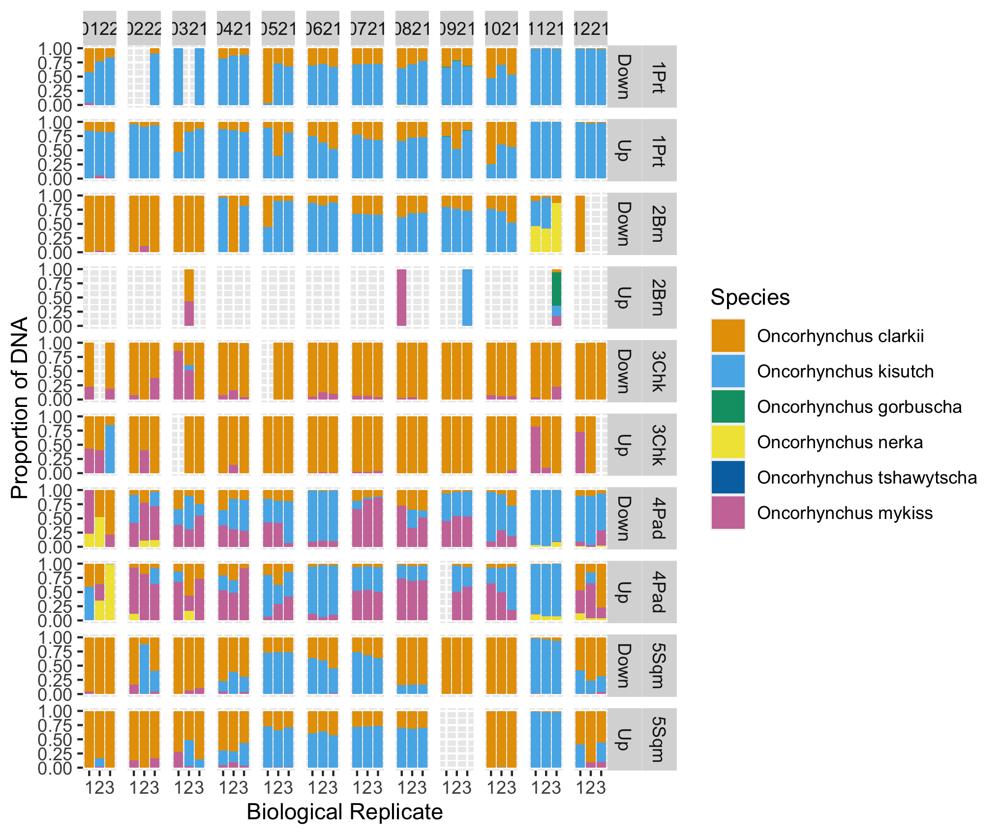
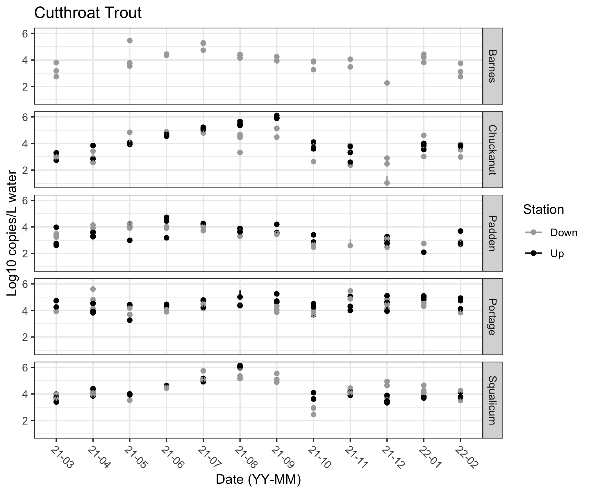

```{r setup, include=FALSE}
knitr::opts_chunk$set(echo = TRUE)
library(here)
```


[Draft for *Ecological Applications*, Fall 2022]

## Abstract

Environmental laws around the world require some version of an environmental impact assessment surrounding construction projects and other discrete instances of human development. Information requirements for these assessments vary by jurisdiction, but nearly all require an analysis of the living elements of affected ecosystems. Because it is possible to sample and amplify the genetic material of many species present in those environments, amplicon-sequencing — also called metabarcoding or eDNA analysis — is a tractable, powerful, and increasingly common way of doing environmental impact analysis for development projects. Here, we analyze a 12-month time-series of water samples taken before, during, and after a construction project in a salmonid-bearing freshwater stream. We use an asymmetrical BACI design with multiple control streams to develop a robust background expectation against which to evaluate the impact of this discrete human intervention in the treatment stream. We generate calibrated, quantitative metabarcoding data from 12s mtDNA and complementary qPCR data to yield multispecies estimates of absolute eDNA abundance across time, creeks, and sampling stations. We then use a hierarchical Bayesian time-series model to reveal patterns of eDNA abundance over time, and to estimate the effects of the culvert removal on salmonids in the treatment creek. 
  We focus our analysis on three common salmonid species in the data: *Oncorhynchus clarkii*, *O. kisutch*, and *O. mykiss*. After accounting for temporal variability common to the sampled creeks, we find only transient effects on these species during the several months after construction. In the context of billions of dollars of court-mandated road-culvert replacements taking place in Washington State, USA, our results suggest that culvert-removal can be conducted with only minimal impact to key species of management concern. More broadly, we demonstrate a rigorous, quantitative method for environmental-impact reporting using eDNA that is widely applicable in environments worldwide.


## Introduction

[much of the below from the grant proposal; need to update/smooth, obviously]

At present, it is difficult or impossible to measure the environmental impacts of discrete human activities, despite such assessment often being required by law.

Sequencing environmental DNA (eDNA) is means of surveying many species in a consistent and scaleable way. Sampling eDNA before, during, and after a development project would be a new and powerful way of assessing that project’s impacts on the local biological communities, and conceivably could become the standard way to do such impact assessment.

All methods of environmental sampling are biased, in the sense that they capture a selective portion of the biodiversity present. Net samples for fish, for example, fail to capture species too small or too large to be caught in the net; bacterial cultures capture only those species that can be cultured on available media, and so forth. Despite the pleasing simplicity of the idea, there is no one way to survey the world and just “see what is there.” Environmental DNA, however, comes as close to this goal as any method yet developed: a sample of water, soil, or even air, contains the genetic traces of many thousands of species, from microbes to whales.

Surveying the natural world by amplifying and sequencing DNA from environmental sources such as water, air, or soil has long been commonplace in microbial ecology (Rondon et al. 2000; Ogram, Sayler, and Barkay 1987; Turnbaugh et al. 2007) , but has recently become popular for characterizing ecological communities of eukaryotes (Port et al. 2016; Stat et al. 2017; R. P. Kelly et al. 2014; Valentini et al. 2016; Taberlet et al. 2012; De Vargas et al. 2015). Because the source of samples is the environment itself rather than specific target organisms, the data resulting from such studies have become known as environmental DNA (eDNA) (Taberlet et al. 2012); the ultimate source of genetic material in the environment may be living or waste cells or extracellular DNA (Taberlet et al. 2012). Techniques that take advantage of such data may include non-PCR-based methods such as hybridization, but generally include an amplification step such as quantitative PCR, digital- droplet PCR, or traditional PCR from mixed templates followed by high-throughput sequencing. This last technique is known as metabarcoding, eDNA amplicon-sequencing, or more generally, marker-gene analysis.

In the metabarcoding context, broad-spectrum PCR primers capture many taxa across a very wide diversity of the tree of the life (Leray et al. 2013), but nevertheless the absence of a taxon from a sequenced sample does not indicate the absence of that taxon from the environment. Instead, the unsampled species simply may not have been susceptible to that set of PCR primers, and so failed to amplify. The result is often a dataset that represents hundreds or thousands of taxa, but these taxa are a fraction of a larger (and perhaps taxonomically broad) pool of species present. Using multiple, independent primer sets increases taxonomic scope by drawing from overlapping pools of taxa (Kelly et al. 2017), maximizing the likelihood of detecting any given taxon present. In virtually all comparisons, metabarcoding recovers far more taxa from an area than any other sampling method (Port et al. 2016; Kelly et al. 2017).

The results of metabarcoding studies differ dramatically from those of traditional, non- PCR-based sampling methods as a result of the PCR process itself. This exponential process means that 1) small changes in laboratory technique can yield large differences in outcomes, 2) PCR-based assays likely act differently on every target species, 3) there is consequently no one-to-one correspondence between the number of assigned reads in an eDNA study and the abundance of the source organism, and 4) neither might we expect a universally strong correlation in estimates of taxon-richness between eDNA and traditional methods. By understanding these process differences, we can correct for taxon-specific biases in ampification effiency to yield quantitative estimates of the community composition prior to PCR (Shelton et al. submitted). 

The resulting dataset is compositional, revealing the proportions of each species' DNA present in each sample, but importantly this contains no information about the absolute abundance of DNA present. We can tie these proportional estimates to absolute abundances using additional data such as a qPCR assay for one of the taxa present.  

...

Here, we report the results of a yearlong sampling effort before, during, and after a small construction project in our experimental creek, assessing the impact of that project on the salmonid species present. We do so using a combination of metabarcoding (12s mtDNA) and qPCR to yield quantitative estimates of the concentrations of DNA present at each time point, and we use parallel samples from an additional four control creeks to develop a causal analysis of changes in these concentrations.  


As a result of a federal court ruling [US v Washington, culvert case, J. Martinez], Washington State is under a court order to replace many of the culverts that allow water to pass under roads and highways. These culverts, at present, collectively prevent or hinder anadomous salmon species from using [thousands of square kilometers] of habitat, which in turn violates the treaty rights of the region's indigenous tribes. Because replacing culverts can require substantial intervention -- for example, diverting the water from a creek segment and rebuilding the road with a redesigned culvert -- and because these replacements occur serially according to a schedule, they present an attractive experimental design.


...


A clear opportunity for policy-relevant eDNA work is in using its power to survey many species at a time to improve the way we assess the impacts of human activities. Within the United States, both state and federal laws often require a form of environmental-impact assessment for medium- to large-scale projects (i.e., those that might have a significant impact on the environment). Outside the US, many nations have their own versions of these same laws. Environmental assessments have begun to make use of eDNA for such work [CITE NatureMetrics, few published examples] around the world; in the U.S., however, assessments generally continue to rely on literature reviews or field measurements of a few key species, selected beforehand. [Moreover, they often lack post-project sampling, given that the goals of a development project normally focus on construction itself, etc.]

## Methods 

We used an asymmetrical BACI (Before-After-Control-Impact, CITE) study design to measure the environmental impact of a construction project replacing the under-road culvert in the treatment creek. We sampled four control creeks in addition to the treatment creek (FIGURE) at monthly intervals, both upstream and downstream of each creek's culvert. Because salmonids are the primary species of management concern in these creeks, we focus the present analysis on the three salmonid species most common in our data: *Oncorhynchus clarkii* (cutthroat trout), *O. kisutch* (coho salmon), and *O. mykiss* (rainbow trout and steelhead).

As further described below, we surveyed the salmonid DNA present in each creek via 12s mtDNA sequencing and complementary cytb[?] qPCR for a reference species (*O. clarkii*), which in combination yielded quantitative estimates for each fish species throughout the study area. 

Construction to replace the culvert in our treatment creek occurred midway through our yearlong survey. We were then able to quantify the effect of the culvert replacement itself -- controlling for temporal trends, background environmental variability, and sampling variability -- using a Bayesian time-series model to jointly model salmon eDNA abundances across creeks, timepoints, sampling stations, and species. 

### Water Sampling

We collected water samples monthly between March 2021 and February 2022 in each of five salmonid-bearing creeks in northwest Washington State, USA (MAP). We sampled each stream above and below under-road culverts, each of with a different degree of expected fish passibilty [CITE]. At each sampling station (upstream and downstream of a culvert) at each creek (N = 5) in each month (N = 12), we collected three 2-liter water samples, for a total of 360 samples.

<!-- have various degrees of fish passability: the treatment creek's culvert -- suspected impassible -- was removed and replaced during the course of the study; two of the four creeks had culverts allowing fish passibility, and two had culverts blocking fish passage. Fish passibility was determined by the Washington Department of Transportation [CITE]. -->

<!-- *STOCKING IN LAKE PADDEN -->

<!-- water flow variation -->

<!-- ```{r FIG1_map, fig.cap="\\label{fig:map} Figure 1: Map of sampling locations in Bellingham, Washington. Locations of stream gauges are shown for three of the five creeks sampled.", fig.path=here("Output","Figures"), echo=F, message=F, warning=F, include = T, fig.height=4, dpi = 300} -->
<!-- # knitr::include_graphics(here("Output","Figures","map.png"), auto_pdf = TRUE) -->
<!-- ``` -->

Water samples were collected using Smith Root's ANDe eDNA Backpack [CITE], a portable pumping-and-filtering setup set to filter at 1L/min at 82.7 kPa (12 psi). In some months, less than 2 L of water was filtered due to clogging (Supplemental Table X). Water samples were filtered through 5$\mu$m self-preserving filters (Smith Root, Vancouver, WA) using single-use inlet tubes, dried, and kept at room temperature until DNA extraction within 1 month of collection (CITE self-preserving filter paper).

<!-- For most months, a trident sampler was used to collect all 3 biological replicates at the exact same time, for a total sampling time of about 5 minutes. Otherwise, the three replicates were collected consecutively, for a total sampling time of about 15 minutes. The backpack also monitored pressure and flow rate over the course of sampling. The backpack was set to have a target flow rate of 1 L/min and a max pressure of 12 psi.   -->

### DNA Extraction, Amplification, Sequencing

<!-- All molecular work was performed at the University of Washington. Benchtops were cleaned with 10% bleach for 10 minutes and then wiped with 70% ethanol. Molecular work was separated onto pre- and post-PCR benches; all DNA extractions and PCR preparation was conducted on a bench where no PCR product was handled. [Move to supplement?] -->  

<!-- Filters were removed from their housing with sterile tweezers and cut in half using sterile razor blades.  -->
We extracted DNA from half of each filter using a Qiashredder column (Qiagen, XX) and the DNEasy Blood and Tissue Kit (Qiagen, XX) with an overnight incubation (Supplemental File X), such that the effective environmental sampling effort was 1L / sample; the remaining half of each filter was archived at -20\degree C.

Extracts were eluted in 100 uL of molecular grade water, quantified via Qubit (Invitrogen, XX) and stored at -20\degree C until PCR amplification within X months of extraction (check longest time waited). 

We targeted a ~170 bp hypervariable region of the mitochondrial DNA 12S rRNA gene for PCR amplification (MiFish; CITE Miya et al.), but using modified primer sequences as given in Praebel and Wangensteen [cite] and including the Illumina Nextera overhang sequences for subsequent indexing. The primers used were as follows: F 5' TCGTCGGCAGCGTCAGATGTGTATAAGAGACAGGCCGGTAAAACTCGTGCCAGC 3', R 5' GTCTCGTGGGCTCGGAGATGTGTATAAGAGACAGCATAGTGGGGTATCTAATCCCAGTTTG 3' (italics indicates Nextera overhang). 

PCR reactions included 10 uL of 5X Platinum ii Buffer, 0.4 uL of Platinum ii Taq, 1.25 uL of 8 mM dNTPS, 1.25 uL of 10 uM F primer, 1.25 uL of 10 uM R primer, 5 uL of template, and 30.85 uL of molecular grade water, for a total reaction volume of 50 uL. Cycling conditions were as follows: 95C for 2 min, 35 cycles of 95C for 30 sec, 60C for 30 sec, 72C for 30 sec, followed by a final extension of 72C for 5 min. Each month of samples was amplified on a single plate with the addition of a no template control (NTC; molecular grade water in lieu of template) and a positive control (genomic DNA from kangaroo). After PCR amplification, PCR products were visualized on a 1-2% gel. If no band was present for a given sample, a new amplification was attempted with extracts diluted 10x iteratively until a band was detected. PCR products were size-selected and cleaned using MagBind Beads (Omega Biotek, XX) at a sample:beads ratio of 1.2. Bead-cleaned PCR products were eluted in 30 $\mu$L of molecular grade water and quantified via Qubit (CITE).

A indexing PCR reaction added a unique index to each sample using Nextera indices (Illumina, XX) to allow pooling multiple samples onto the same sequencing run. For indexing, 10 ng of PCR product was used as template in a final volume of 11.25 uL. For samples with concentrations less than 0.88 ng/uL, 11.25 uL was added despite being less than 10 ng of amplicon. Each sample received a unique index; Nextera index sets A and B were used in combination to avoid using the same index for more than one sample on a single sequencing run. The PCR reaction included the 11.25 uL of template, 12.5 uL of Kapa HiFi MMX (Roche, XX), and 1.25 uL of indexed primer. Cycling conditions were as follows: 95C for 5 min, 8 cycles of 98C for 20 sec, 56C for 30 sec, 72C for 3 min, and a final extension of 72C for 5 min. Indexed PCR products were also size-selected and purified using MagBind Beads (Omega Biotek, XX) at a sample:beads ratio of 0.8. Bead-cleaned PCR products were eluted in 30 $\mu$L of molecular grade water and quantified via Qubit. 

Samples were randomized in 3-month blocks and each block split across 3 sequencing runs, for a total of 12 MiSeq runs. Indexed and bead-cleaned products were normalized before pooling into libraries, which were subsequently quantified via Qubit and visualized on a Bioanalyzer (Agilent, XX) before sequencing. The loading concentration of each library was 4 nM and 5-20% PhiX was included depending on the composition of the run (Supplemental Table X). 

In total, sequencing runs generated ~42 million reads across XX environmental samples (12 months x 2 stations x 5 creeks x 3 biological replicates = 360 filters) and 27 mock community samples (3 communities x 9 replicates [6 even, 3 skewed proportions]) for calibration (see below). After quality-filtering and merging all runs, XX reads remained from XX amplicon sequence variants (ASVs), of which XX% of reads and XX% of reads were annotated to species level. 

Importantly, the particular target salmonid ASVs in the mock communities were found in environmental samples, unambiguously linking the taxa in calibration samples with those in environmental samples.

<!-- The most common salmonid species found in the environmental samples was XX (cutthroat trout?), with XX% of samples across times, creeks, and stations having at least 50% of reads assigned to *O. clarkii*. -->

### Bioinformatics 

Pipeline description and online availability. N sequences, etc., with table of pipeline steps and surviving N sequences at each of those steps.

After sequencing, bioinformatic analyses were conducted in R [cite R]. Primer sequences were removed using Cutadapt (Version 1.18) [cite cutadapt] before dada2 [cite] trimmed, filtered, merged paired end reads, and generated amplicon sequence variants (ASVs). Taxonomic assignment was conducted via the insect package [cite] using a tree generated by the developers for the MiFish primers that was last updated in November 2018. Only species level assignments from insect were retained and ASVs not annotated or not annotated to species level were then checked against the NCBI nucleotide database using BLAST+ [cite]. Query sequences that matched a single species at >95% identity were retained.  


### Quantitative PCR

We quantified cutthroat trout (*Oncorhynchus clarkii*) DNA in each sample, targeting a 114 bp fragment of the cytochrome b gene with a qPCR assay (CITE-- Duda?). The primer/probe sequences were: F 5' CCGCTACAGTCCTTCACCTTCTA 3', R 5' GATCTTTGTATGAGAAGTAAGGATGGAA 3', P 5' 6FAM-TGAGACAGGATCCAAC-MGB-NFQ 3'.

<!-- and Coho salmon (Oncorhynchus kisutch). The O. clarkii assay .  The O. kisutch assay also targeted a 114 bp fragment of the cytochrome b gene. The primers/probe sequences were: F 5' CCTTGGTGGCGGATATACTTATCTTA 3', R 5' GAACTAGGAAGATGGCGAAGTAGATC 3', P: 5' 6FAM-TGGAACACCCATTCAT-MGB-NFQ 3'. All samples were run with the O. clarkii assay. The O. kisutch assay was only used for samples from Padden Creek and for samples from the other four creeks where O. clarkii was not detected.  -->

The qPCR assay was multiplexed with TaqMan Exogenous Internal Positive Control Reagents (EXO-IPC) (Applied Biosystems) to check for the presence of PCR inhibitors. Each DNA sample was run in triplicate using Gene Expression Mastermix (XX), a final concentration of 0.375 uM F primer, 0.375 uM R primer, and 0.105 uM probe, as well as 1X EXO-IPC mix, 1X EXO-IPC DNA, 3.5 uL of template for a final reaction volume of 12 uL. The EXO-IPC mix includes the primers and probe for the EXI-IPC DNA, with the probe having a VIC reporter, allowing it to be multiplexed with the *O. clarkii* assay, which has a FAM reporter. 

<!-- The O. kisutch assay was also run in triplicate using Gene Expression Mastermix (XX), a final concentration of 0.375 uM F primer, 0.375 uM R primer, and 0.105 uM probe, 3.5 uL of template, and molecular grade water for a final reaction volume of 12 uL (without the EXO-IPC kit).  -->
Thermocycling was as follows: 50C for 2 min, 95C for 10 min, followed by 45 cycles of 95C for 15 sec, 60C for 1 min. The cycle threshold (Ct) value determined for the EXO-IPC assay from the NTC was compared to the Ct value for the EXO-IPC assay in each of the environmental samples. If the Ct value was >0.5 Ct values from the mean Ct for the NTCs, the sample was deemed inhibited and diluted 1:10 and re-assayed until the Ct value fell within the accepted range. 

<!-- For inhibited samples, the final dilution determined was then used for the O. kisutch assay and after converting Ct values to DNA concentrations using the standard curve, the concentration was multiplied by the dilution factor.  [Only using O.clarkii in the paper, seemingly, so focus just on that species -- RPK] --> 

Each plate included a 8-point standard curve created using synthetic DNA (gBlocks) at the following concentrations: 100,000 copies/uL, 10,000 copies/uL, 1,000 copies/uL, 100 copies/uL, 10 copies/uL, 5 copies/uL, 3 copies/uL, 1 copy/uL. Additionally, six NTCs were included on each plate: 3 with the IPC DNA mix and 3 with molecular grade water instead of template or IPC DNA mix. All qPCRs were conducted on an Applied Biosystems StepOnePlus thermocycler. Plates were re-run if efficiency as determined by the standard curve was outside of the range of 90-110%. 

All qPCR data was processed in R using Stan, relating environmental samples to the standard curve via a linear model. We amended the standard linear regression model to more realistically capture the behavior of qPCR observations, accommodating non-detections as a function of underlying DNA concentration, and letting the standard deviation vary with the mean (lower-concentration samples had more uncertainty). See also See Shelton et al. 2019; McCall et al. 2014 (<https://www.ncbi.nlm.nih.gov/pmc/articles/PMC4133581/>); see supplement for full statistical details. 

### Quantitative Metabarcoding

[Calibration with mock community; description of Stan model with reference to Shelton et al.] 

Calibrated metabarcoding analysis yielded quantitative estimates of the proportions of species' DNA in environmental samples prior to PCR. We then converted these proportions into absolute abundances by expansion, in light of the qPCR results for our reference species *O. clarkii*. We estimated the total amplifiable salmonid DNA in environmental sample $i$ as $DNA_{salmonid_{i}} = \frac{[qPCR_{reference_{i}}]}{Proportion_{reference_{i}}}$, and then expanded species' proportions into absolute concentrations by multiplying these sample-specific total concentrations by individual species' proportions, such that for species $j$ in sample $i$, $DNA_{i,j} = DNA_{salmonid_{i}} * Proportion_{i,j}$.


<!-- ```{r FIG2_conceptualframework, fig.cap="\\label{fig:map} Figure 2: Conceptual framework outlining data and models used for analyses.", fig.path=here("Output","Figures"), echo=F, message=F, warning=F, include = T, fig.height=4, dpi = 300} -->
<!-- # knitr::include_graphics(here("Output","Figures","conceptual_framework.png"), auto_pdf = TRUE) -->
<!-- ``` -->


### Estimating the Effects of Culvert Replacement and of Culverts Themselves

Consistent with the asymmetrical BACI study design, we generated data from our four control creeks as context against which to compare the observations in Padden Creek, our treatment creek. 

Recognizing that these observations are autocorrelated in time, we use an AR(1) autocorrelation model, implemented in Stan via R, to capture the observed temporal trends. At time $t$, the expected log-DNA concentration for species $j$ in creek $i$ at station $d$ is a linear function of the DNA concentration for the same species/creek/station at $t-1$ (Equation X). We add an index $r$ to distinguish samples from creeks and time-points that had not undergone culvert replacement (controls; $r = 1$) from those samples in the treatment creek during and post-replacement (treatment; $r = 2$). 

The model shares information across creeks and time-points via a species-specific slope term $\beta_{j}$, which reflects characteristic degrees of autocorrelation for each species. Intercept $\alpha$ varies by time, creek, and species, capturing creek-level deviations from the previous time-step. 

The $\gamma$ term explicitly captures the effect of culvert replacement at time $t$ for species $j$. We define $\gamma_{r = 1} = 0$, such that the parameter estimates for samples during and after replacement, $\gamma_{r = 2}$, capture the effect of culvert replacement relative to a baseline of zero.

Finally, for a given time/creek/species, the difference in log-DNA concentration between upstream and downstream stations is calculated as the difference between the parameter values of $\eta$ for the two stations. All samples share a species-specific observation-variance term, $\sigma_{j}$.  

We fitted this model in a Bayesian framework using moderately informative priors on all parameters, and confirmed model convergence ($\hat{R} < 1.01$) across 3 chains and 2500 model iterations. See statistical supplement for prior values, diagnostics, and full model details.


```{=tex}
\begin{align*}
 Y_{i,t,d,j} &\sim \mathcal{N}(\mu_{i,t,d,j},\,\sigma^{2})\\
\mu_{i,t,d,j} &= \alpha_{i,t,j} + \beta_{j}\mu_{i,t-1,d,j} + \gamma_{t,j,r} + \eta_{i,t,d,j}
\end{align*}
```


## Results

### Metabarcoding and Quantitative PCR

After calibrating metabarcoding data using mock communities, we estimated the salmonid composition across timepoints, creeks, and stations (FIGURE). The culvert in one control creek (Barnes) appeared to be a total barrier to salmonid passage, with [ZERO] salmonid eDNA detected upstream of the culvert, in contrast to the downstream station of the same creek. The other four creeks had no such pattern associated with the culverts, suggesting that fish passage may have been possible in each case. 

The intercalibration of the mock community samples demonstrates the rank order of ampliciation efficiencies for salmonids (Supplemental Figure X). 

<!-- Of the seven salmonids included in the mock community, *O. gorbuscha* had the highest amplification efficiency and *O. kisutch* had the lowest amplification efficiency (Supplemental Figure X).  -->

<!-- In the environmental samples, proportions of reads were then corrected to account for these varying amplification efficiencies to obtain the initial proportions of DNA per species prior to PCR amplification (Figure X).   -->


<!-- ```{r FIG4_metabarcoding, fig.cap="\\label{fig:metabarcoding} Panel A) Compositions of salmonid DNA as determined by metabarcoding after correction for amplification bias. B) Absolute concentrations of salmonid DNA using total DNA derived from cutthroat qPCR results.", fig.path=here("Output","Figures"), echo=F, message=F, warning=F, include = T, fig.height=4, dpi = 300} -->
<!-- knitr::include_graphics(here("Output","Figures","metabarcoding_stackbar_absolute.png"), auto_pdf = TRUE) -->
<!-- ``` -->

 


[FIGURE]

All environmental samples (n = 356, should be 357, one set of triplicates missing from Sqm Up August, otherwise 3x2x5x12 = 360) were quantified for absolute concentrations of cutthroat trout DNA across 30 plates, resulting in 280 samples with a positive detection in at least 1 of 3 technical replicates. 
<!-- A subset of samples (n = 111, all of Padden Creek and then any samples that were not detected using the cutthroat assay) were quantified for coho salmon across 12 plates, resulting in 56 samples with a positive detection in at least 1 of 3 technical replicates. For all 42 plates, efficiencies ranged from X to X%. -->

<!-- NOTE TO SELF - go back and find why 0222_1Prt_Up_2 has two sets of triplicates and 0222_1Prt_Up_1 is missing in cut -- and coho has too many reps for 0222.3Chk.Up.1, 0621.2Brn.Up.2, and 1121.2Brn.Dn.3.  -->

The majority of environmental samples (65%) were inhibited and accordingly diluted for analysis. In 75% of inhibited samples, a 1:10 dilution remedied the inhibition, but some samples required dilution by a factor of up to 1000. Subsequent analysis corrected for sample-specific dilution -- and similarly, any variation in water-volume filtered during sample collection -- using an offset in the model linking observed Ct values to copies/L via a standard curve. The modeled output of cutthroat trout DNA concentrations, ranged from 10 copies/L to 1,377,656.67 copies/L, with a mean value of 57,529 copies/L. 

<!-- Coho DNA concentrations ranged from 27 copies/L to 1,214,611 copies/L with a mean value of 46,132 copies/L.  -->

<!-- ```{r FIG3_qpcr, fig.cap="\\label{fig:qpcr} ", fig.path=here("Output","Figures"), echo=F, message=F, warning=F, include = T, fig.height=4, dpi = 300} -->
<!--  knitr::include_graphics(here("Output","Figures","modeled_cut_qpcr_updown.png"), auto_pdf = TRUE) -->
<!-- ``` -->

 

We combined compositional information from metabarcoding with absolute concentrations for our reference species, *O. clarkii*, from the qPCR to estimate the total concentration of DNA for each species (see Methods). 

The total DNA concentration of salmonid DNA in environmental samples ranged from XX to XX copies/L (Supplemental Figure X), with the highest concentrations found in X month and in X creek. 

### Trends in Abundance

The joint time-series model shared information across stations and creeks; consequently, data from one of the control creeks (Barnes) could not be included because of the total absence of salmonids upstream of its culvert. However, data from the remaining creeks characterized trends in the target species well (FIGURE X).

  

Uncertainty at each time-point is related to mean abundance [I think].

[NOTE: need to 1) reorder creeks and highlight Padden as experimental, and 2) indicate months of construction with shading].

### Effects of Culvert-Removal and of Culverts Generally


The effects of the culvert-removal operation appear to have been transient and fairly minor for the three salmonid species surveyed. After the beginning of construction in September, we observed a ca. 20-25% reduction in salmonid DNA in the treatment creek attributable to the intervention itself (i.e., after accounting for autocorrelation and seasonal effects) in October (figure X). Upon re-watering in November, the construction effect had disappeared; it remained small to negligble for the remaining sampling months. 

Furthermore, as is clear from the largely parallel abundance trends between upstream and downstream stations (FIGURE X), the culverts themselves had only a minor effect on the salmonid species surveyed. 

[A notable exception is O. mykiss in Portage Creek during March and April.]

Summarizing over all species, all creeks, the effect was only significant during the dry periods of summer (July, August, and September), when flows were at a minimum and the connectivity between upstream and downstream was low. Salmonid species were higher upstream than downstream during this period, with mean upstream DNA about 6% higher concentration than downstream DNA. 

[what if fish were all upstream, and that's where DNA was?]


Individual species' patterns were similar (see supplement).


## Discussion

### Environmental DNA can provide quantitative measurements of environmental impacts

A clear seasonal pattern occurred for all the salmonids detected in the study. The time series model uses shared information across creeks to include the change in eDNA concentrations due to time, whether a sample was collected below or above a barrier (i.e., culvert), and whether or not there was construction occurring. 

In this was, we could isolate the changes in eDNA concentrations as a result of the intervention (i.e., construction) while accounting for the variance due to time and station (i.e., culvert).       

### Not all culverts are barriers 
By measuring DNA concentrations of species above and below culverts on a small spatial scale, we were able to determine how much of a barrier each culvert was (or was not) to fish passage. We found that four of the five creeks sampled were not actually major barriers to fish passage. The only creek that was determined to be a barrier to fish passage was Barnes Creek, which was also the largest distance between the downstream and upstream station. 

Though eDNA can move downstream with water flow, here, we were measuring if culverts were barriers to fish moving upstream as we were focused on the impact of culverts on migratory salmon. In our case, we were comparing if downstream stations had higher DNA concentrations than upstream stations as a result of fish being unable to get upstream. 


### Salmonids can survive a bulldozer in a creek 

The intervention (i.e., construction) in Padden Creek occurred over about two months and included the "de-watering" of the creek, removal of the existing culvert, installation of the new culvert, and then the "re-watering" of the creek. 

## Conclusion

