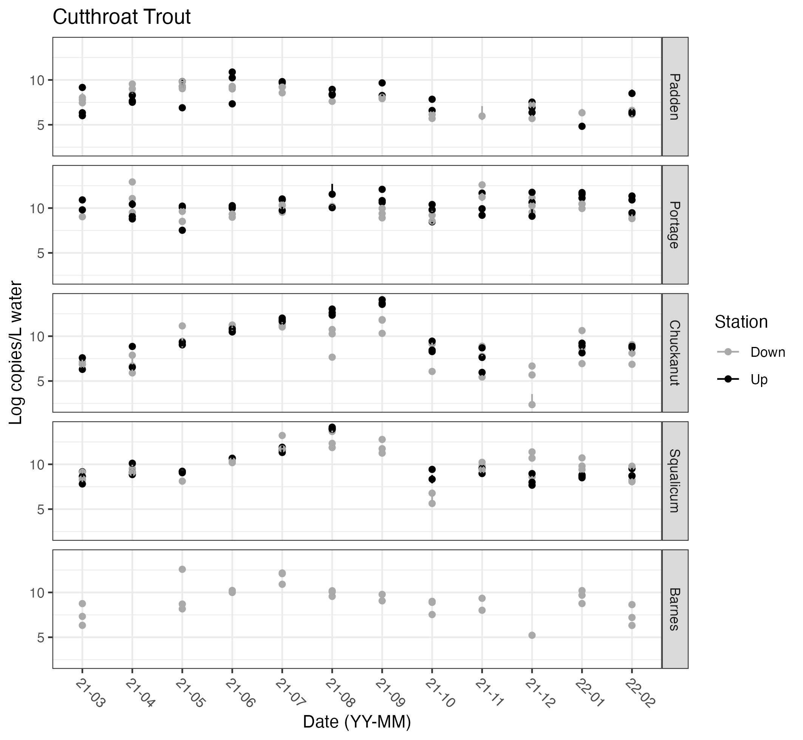
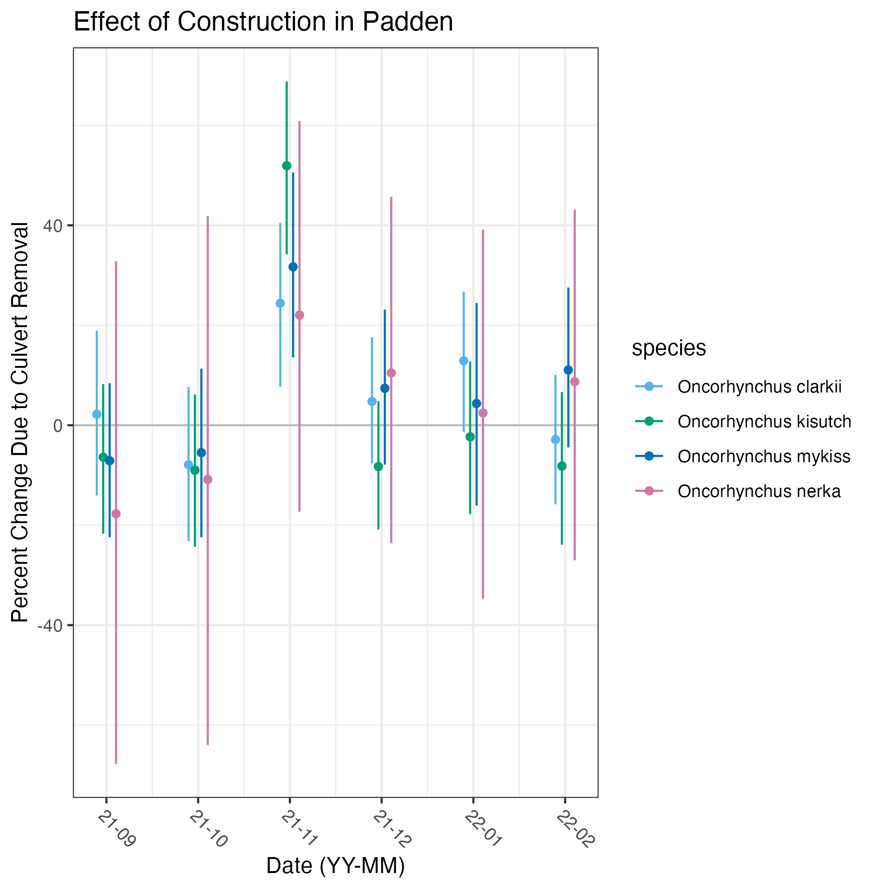

```{r setup, include=FALSE}
knitr::opts_chunk$set(echo = TRUE)
library(here)
```

[Draft for *Ecological Applications*, Fall 2022]

## Abstract

Environmental laws around the world require some version of an environmental impact assessment surrounding construction projects and other discrete instances of human development. Information requirements for these assessments vary by jurisdiction, but nearly all require an analysis of the biological elements of affected ecosystems. Amplicon-sequencing --- also called metabarcoding --- of environmental DNA (eDNA) has made it possible to sample and amplify the genetic material of many species present in those environments, providing a tractable, powerful, and increasingly common way of doing environmental impact analysis for development projects. Here, we analyze a 12-month time-series of water samples taken before, during, and after a culvert removal project in a salmonid-bearing freshwater stream. We use an asymmetrical Before-After-Control-Intervention (BACI) design with multiple control streams to develop a robust background expectation against which to evaluate the impact of this discrete environmental intervention in the treatment stream. We generate calibrated, quantitative metabarcoding data from amplifying the 12s MiFish mtDNA locus and complementary species-specific quantitative PCR data to yield multi-species estimates of absolute eDNA abundance across time, creeks, and sampling stations. We then use a hierarchical Bayesian time-series model to reveal patterns of eDNA concentrations over time, and to estimate the effects of the culvert removal on salmonids in the treatment creek. We focus our analysis on four common salmonid species: cutthroat trout (*Oncorhynchus clarkii*), coho salmon (*O. kisutch*), rainbow trout (*O. mykiss*), and sockeye salmon (*O. nerka*). After accounting for temporal variability common to the sampled creeks, we find only transient effects on these species during the several months after construction. In the context of billions of dollars of court-mandated road culvert replacements taking place in Washington State, USA, our results suggest that culvert replacement can be conducted with only minimal impact to key species of management concern. More broadly, we demonstrate a rigorous, quantitative method for environmental impact reporting using eDNA that is widely applicable in environments worldwide.

## Introduction

At present, it is difficult or impossible to measure the environmental impacts of discrete human activities, despite such assessment often being required by law. Within the United States, both state and federal laws often require a form of environmental-impact assessment for medium- to large-scale projects (i.e., those that might have a significant impact on the environment) [@morgan2012]. Outside the US, many nations have their own versions of these same laws. Specifically when measuring impacts on aquatic ecosystems, assessments generally continue to rely on literature reviews or field measurements of a few key species, selected beforehand [@rubin2017]. These traditional methods are often expensive, rely on just a few species, and are extremely limited in spatial and temporal coverage [@martin2012]. Moreover, they often lack pre- or post-project monitoring, or sufficient post-project sampling, given that the goals of a development project normally focus on construction itself and funding is often extremely limited. For example, a recent literature review of stream restoration projects cites that more than half of projects (62%) had no pre-project monitoring and only sampled once per year [@rubin2017]. Thus, current assessment efforts relying on traditional survey methods often fall short in documenting and quantifying environmental impacts.

A key difficulty in conducting ecosystem assessments is that there is no one way to survey the world and just "see what is there." All methods of environmental sampling are biased, in the sense that they capture a selective portion of the biodiversity present [@rubin2017]. Net samples for fish, for example, fail to capture species too small or too large to be caught in the net; bacterial cultures capture only those species that can be cultured on available media, and so forth. Environmental DNA (eDNA), however, comes as close to this goal as any method yet developed: a sample of water, soil, or even air, contains the genetic traces of many thousands of species, from microbes to whales. Sequencing eDNA is therefore a means of surveying many species in a consistent and scalable way [@taberlet2012; @thomsen2015]. Environmental assessments have begun to make use of eDNA for such work around the world [@moss2022; @maasri2022; @klein2022; @duda2021; @muha2017], but are not yet common practice. Sampling water to collect eDNA before, during, and after a development project would be a new and powerful method of assessing that project's impacts on the local biological communities, and could conceivably become the standard approach to conducting such impact assessments [@hinz2022].

Surveying the natural world by amplifying and sequencing DNA from environmental sources has long been commonplace in microbial ecology [@ogram1987; @rondon2000; @turnbaugh2007], but has recently become popular for characterizing ecological communities of eukaryotes [@taberlet2012; @kelly2014; @port2015; @devargas2015; @valentini2016; @stat2017]. Techniques that take advantage of such data may include non-PCR-based methods such as hybridization, but generally include an amplification step such as quantitative PCR, digital or digital-droplet PCR, or traditional PCR from mixed templates followed by high-throughput sequencing [@ruppert2019]. This last technique is known as metabarcoding, eDNA amplicon-sequencing, or more generally, marker-gene analysis.

In a metabarcoding approach, broad-spectrum PCR primers capture many taxa across a very wide diversity of the tree of the life (e.g., @leray2013), but nevertheless the absence of a taxon from a sequenced sample does not indicate the absence of that taxon from the environment [@shelton2016; @kelly2019; @buxton2021]. Instead, the unsampled species simply may not have been susceptible to that set of PCR primers, and so failed to amplify. The result is often a dataset that represents hundreds or thousands of taxa, but these taxa are a fraction of a larger (and perhaps taxonomically broad) pool of species present. Using multiple, independent primer sets increases taxonomic scope by drawing from overlapping pools of taxa [@kelly2017], therefore maximizing the likelihood of detecting any given taxon present. In virtually all comparisons, metabarcoding recovers far more taxa from an area than any other sampling method [@port2015; @kelly2017; @seymour2021].

However, we expect results from metabarcoding to differ dramatically from non-PCR based sampling methods due to the fundamental differences in sampling for genetic waste as opposed to whole organisms. Furthermore, eDNA analyses rely on several laboratory processes, including PCR amplification, all of which contribute to complicating the interpretation of results (see @shelton2016 and @kelly2019 for more information). Specifically, PCR amplification is an exponential process for which the efficiency varies across species. By understanding these process differences, we can correct for taxon-specific biases in amplification efficiency to yield quantitative estimates of the community composition prior to PCR [@mclaren2019; @shelton].

After correcting for amplification biases, the resulting metabarcoding dataset is compositional, revealing the proportions of each species' DNA present in each sample, but importantly, contains no information about the absolute abundance of DNA present. We can tie these proportional estimates to absolute abundances using additional data such as a quantitative PCR (qPCR) assay for one of the taxa present. Thus, a single qPCR assay and a single metabarcoding assay can together provide quantitative estimates of many species as opposed to running as many qPCR assays as species of interest. Together, we can use these data to assess changes in eDNA concentrations of species over time, and due to environmental impacts, such as replacing a culvert under a road.

<!-- Add transition sentence here? -->

As a result of a federal ruling [@martinez2013], Washington State is under a court order to replace hundreds of culverts that allow water to pass under roads and highways. Culverts can lead to many negative consequences for fish including habitat fragmentation, loss of accessability to spawning and rearing habitat, and genetic isolation [@price2010; @frankiewicz2021]. The culverts that need to be replaced, at present, collectively prevent or hinder anadromous salmon species from using hundreds of miles of habitat, which in turn violates the treaty rights of the region's indigenous tribes. Because replacing culverts can require substantial intervention -- for example, diverting the water from a creek segment and rebuilding the road with a redesigned culvert -- they require environmental impact assessments. Furthermore, because these replacements occur serially according to a schedule, they present an attractive experimental design to use eDNA to assess environmental impacts.

<!-- RPK to check citation on court ruling -->

Presently, the prioritization process conducted by the Washington Department of Transportation is a protocol provided by the Washington Department of Fish and Wildlife, which includes factors such as the amount of habitat blocked by the barrier, the types of species blocked by the barrier, and estimated cost of repair, among other things [@washingtondepartmentoffishandwildlife2019]. However, data on fish presence upstream of barriers are rare and often not included in assessments. Using eDNA as a proxy for fish presence could provide another important type of data for project prioritization and increase efficiency in making prioritization decisions.

Once a culvert has been designated as in need of repair, the intention is to improve conditions for biota, including migrating fish, but it might be that the construction itself has a short-term negative effect on fish and other organisms before the longer-term improvements are realized. Specifically in the case of culvert replacement, studies have cited the negative impacts of construction to include sediment accumulation, removal of vegetation, and blocking flow and stranding fish [@washingtondepartmentoffishandwildlife2019a; @wellman2000]. However, it is unclear how long these effects might last and if the long-term benefits of the culvert replacement justify the short-term costs of the construction. These disruptions also underscore the importance of both properly assessing culverts to determine if they are blocking fish passage and monitoring after construction to ensure the replacement actually improved fish passage.

Many studies have attempted to quantify how effective culvert replacement projects are, either by measuring physical parameters of the culvert and stream after replacement [@price2010], or by measuriing biological indicators including electrofishing [@ogren2015] or utilizing genetic differentiation from fish tissues [@nathan2018; @wood2018]. @price2010 found in a study of \~75 culverts that despite culvert replacement, about 30% of the new culverts still remained blockages (by physical characterization), while @ogren2015 found that after biological sampling (i.e., electrofishing and macroinvertebrate surveys) 3-5 years after culvert replacements at three sites, the overall biotic integrity was not improved. On the other hand, @macpherson2012 found in a study of over 200 culverts, that for certain species, including rainbow trout (*O. mykiss*), culverts were not blocking fish passage despite being deemed blockages. Sampling water for eDNA analysis should be before, during, and post-restoration could provide valuable information on if the restoration is needed, how the restoration negatively impacts communities during construction, and if the restoration efforts did in fact allow for fish passage.

Here, we report the results of a yearlong eDNA sampling effort before, during, and after a small construction project in our experimental creek, assessing the impact of that project on the salmonid species present. We do so using a combination of metabarcoding (12s mtDNA) and qPCR to yield estimates of the concentrations of DNA present at each time point, and we use parallel samples from an additional four control creeks to develop a causal analysis of changes in these concentrations. A clear opportunity for policy-relevant eDNA work is in using its power to survey many species at a time to improve the way we assess the impacts of human activities. Here, we demonstrate the utility of eDNA for such assessments.

## Methods

### Site and Species Selection

We used an asymmetrical BACI (Before-After-Control-Impact) study design to measure the environmental impact of a construction project replacing the under-road culvert in the treatment creek using eDNA [@underwood1992; @underwood1994; @benedetti-cecchi2001]. We sampled four control creeks in addition to the treatment creek (Figure \ref{fig:map}) at monthly intervals, both upstream and downstream of each creek's culvert. The culvert in the treatment creek (Padden) was suspected to be impassible and thus was removed and replaced during the course of the study; two of the four creeks (Portage and Squalicum) had culverts allowing fish passage, and two (Barnes and Chuckanut) had culverts blocking fish passage (see Supplemental Text 1) [@washingtondepartmentoffishandwildlife2019].

The intervention (i.e., culvert replacement) in Padden Creek occurred over about two months and included the "de-watering" of the creek, removal of the existing culvert, installation of the new culvert, and then the "re-watering" of the creek from late August 2021 to October 2021. We were then able to quantify the effect of the culvert replacement itself -- controlling for temporal trends, background environmental variability, and sampling variability -- using a Bayesian time-series model to jointly model salmon eDNA abundances across creeks, time points, sampling stations, and species.

Because salmonids are the primary species of management concern in these creeks, we focus the present analysis on the four salmonid species most common in our data: cutthroat trout (*Oncorhynchus clarkii)*, coho salmon (*O. kisutch*), rainbow and steelhead trout (*O. mykiss*), and sockeye and kokanee salmon (*O. nerka*). As further described below, we surveyed the salmonid DNA present in each creek via eDNA metabarcoding (targeting a region of the 12s mtDNA gene) and complementary quantitative PCR (qPCR; targeting a region of the CytB gene) for a reference species (cutthroat trout, *O. clarkii*), which in combination yielded quantitative estimates for each fish species throughout the study area.

Not all four salmonids are expected to be found in all five of the creeks sampled. As documented by WA Department of Fish and Wildlife SalmonScape (<http://apps.wdfw.wa.gov/salmonscape/map.html>), all creeks contain cutthroat trout, steelhead trout, and coho salmon. Barnes Creek is the only creek documented to have kokanee salmon. However, local spawner surveys conducted by the City of Bellingham from 2015-2020 in Padden Creek document kokanee salmon, as well as the other three species and importantly, several unknown live and dead fish and redds (nests dug by fish in gravel to deposit eggs).

<!-- MGY: citation for COB surveys?  -->

The four salmonid species in this study have different life histories and behaviors that would impact when fish (and therefore eDNA concentrations) occur in the creeks. For these four migratory salmonids, the run timings vary for each species in the study area (Bellingham, WA). Adult coastal cutthroat (*O. clarkii*) are documented to run throughout the entire year, whereas coho salmon (*O. kisutch*) run from September to December, kokanee salmon (*O. nerka*) run from October to December, and steelhead trout (*O. mykiss*) run from November to June. For migrating coho (*O. kisutch*) and steelhead trout (*O. mykiss*), juveniles may be present in the creeks year-round.

Furthermore, three of the four species in this study have both freshwater resident and saltwater migrating behavior. Cutthroat trout (*O. clarkii*) encompasses both non-migrating, resident trout in the creeks and coastal run cutthroat that migrate into Padden Creek from saltwater (Bellingham Bay). Similarly, *O. nerka* includes both anadromous sockeye salmon and freshwater resident kokanee salmon and *O. mykiss* includes both anadromous steelhead trout and non-migrating rainbow trout. Using eDNA, we cannot distinguish between the migrating and non-migrating subspecies of *O. clarkii*, *O. nerka*, and *O. mykiss*. Therefore, our eDNA concentrations might reflect contributions from both migrating and non-migrating individuals at any given time point in the dataset.

### Water Sampling

We collected water samples monthly between March 2021 and February 2022 in each of five salmonid-bearing creeks in northwest Washington State, USA (Figure \ref{fig:map}). We sampled each stream above and below under-road culverts. At each sampling station (N=2, upstream and downstream of a culvert) at each creek (N = 5) in each month (N = 12), we collected three 2-liter water samples, for a total of 360 samples. Water samples were collected using Smith Root's eDNA Backpack [@thomas2018], a portable pumping-and-filtering device set to filter at 1 L/min at 82.7 kPa (12 psi). In some months, less than 2 L of water was filtered due to clogging (min = 1.02 L, mean = 1.97 L, median, 2.01 L; see Supplemental Table 1). Water samples were filtered through 5$\mu$m self-preserving filters (Smith Root, Vancouver, WA) using single-use inlet tubes, which were then dried, and kept at room temperature until DNA extraction within 1 month of collection [@thomas2019].

<!-- Ez to check here and add citation of some kind for passibility. -->

{width="50%"}

<!-- MGY to check lag from collection to extraction. -->

Over the course of the year of sampling, water discharge varied from very low to no flow in summer months to high flow in winter months (Figure 2). Thus, when considering eDNA concentrations at a site, we need to account for the large difference in water volume over the course of the time series. In other words, given the same number of fish and a constant eDNA shedding rate, we would expect to see higher concentrations of DNA in summer months and lower concentrations in winter months due to dilution of eDNA in higher water volumes just from the difference in flow. Other eDNA time series datasets also correct for discharge to present eDNA data as a mass flow rate [mass/time] [@thalinger2019; @tillotson2018]. Here, we convert eDNA concentration [copies/$\mu$L] to an eDNA mass flow rate [copies/s] by multiplying eDNA concentrations by discharge [L/s].

Flow gauges maintained by USGS were used for Padden Creek, Chuckanut Creek, and Squalicum Creek (<https://maps.waterdata.usgs.gov/mapper/index.html>; @u.s.geologicalsurvey1994). During the year of sampling, the flow gauges at Chuckanut Creek and Squalicum Creek became inoperable after a major flooding event. To find discharge rates for Chuckanut and Squalicum Creeks, five years of historical data (2015-2020) were used to generate a monthly averaged correction factor based on Padden Creek. For the year of sampling (2021-2022), the discharge rates used at Chuckanut and Squalicum Creeks were estimated based on the correction factor from Padden Creek (Supplemental Figure 1). No discharge data was available for Portage Creek or Barnes Creek. Based on field sampling conditions, the discharge from Padden Creek was used as a proxy for both Portage and Barnes as they are in similarly sized watershed areas and landcover characteristics. Though in the year of sampling, the discharge in Padden Creek ranged from no metered flow to 23 m\textsuperscript{3}/s, the discharge on the dates of sampling only reached a maximum of 1.3 m\textsuperscript{3}/s.

<!-- Remove stocking from methods? -->

{width="50%"}

Additionally, in the creek of interest, Padden Creek, rainbow trout (*O. mykiss*) were stocked in Lake Padden, approximately 1.5 km upstream of the sampling sites. Occasionally, cutthroat trout (*O. clarkii*) and kokanee salmon (*O. nerka*) have been stocked in the past as well. During the course of the study, a total of 10,000 rainbow trout were stocked in April and May 2021 and 30,000 kokanee salmon were stocked in May 2021 (Supplemental Figure 2).

<!-- Note to self: check no metered flow... set minimum? -->

### DNA Extraction, Amplification, Sequencing

All molecular work prior to sequencing was performed at the University of Washington. Benchtops were cleaned with 10% bleach for 10 minutes and then wiped with 70% ethanol. Molecular work was separated onto pre- and post-PCR benches; all DNA extractions and PCR preparation was conducted on a bench where no PCR product was handled. DNA was extracted from half of each filter using a Qiashredder column (Qiagen, USA) and the DNEasy Blood and Tissue Kit (Qiagen, USA) with an overnight incubation (Supplemental Text 1, @thomas2019), such that the effective filtering effort was 1 L/sample; the remaining half of each filter was archived at -20\degree C. Extracts were eluted in 100 $\mu$L of molecular grade water, quantified via Qubit (Invitrogen, USA) and stored at -20\degree C until PCR amplification within 2 months of extraction.

<!-- MGY - check longest delay from collection to extraction -->

For metabarcoding, we targeted a \~186 bp hypervariable region of the mitochondrial DNA 12S rRNA gene for PCR amplification (MiFish; Miya et al. 2015), but using modified primer sequences as given in Praebel and Wangensteen [cite] and including the Illumina Nextera overhang sequences for subsequent indexing. The primers used were as follows: F 5' *TCGTCGGCAGCGTCAGATGTGTATAAGAGACAG*GCCGGTAAAACTCGTGCCAGC 3', R 5' *GTCTCGTGGGCTCGGAGATGTGTATAAGAGACAG*CATAGTGGGGTATCTAATCCCAGTTTG 3' (*italics* indicate Nextera overhang). The final reaction recipe and cycling conditions can be found in Supplemental Text 1. Each month of samples was amplified on a single plate with the addition of a no template control (NTC; molecular grade water in lieu of template) and a positive control (genomic DNA from kangaroo). After PCR amplification, PCR products were visualized on a 1-2% gel. If no band was present for a given sample, a new amplification was attempted with extracts diluted 1:10 iteratively until a band was detected. PCR products were size-selected and cleaned using MagBind Beads (Omega Biotek, USA) at a sample:beads ratio of 1.2. Bead-cleaned PCR products were eluted in 30 $\mu$L of molecular grade water and quantified via Qubit (Invitrogen, USA).

<!--# Zack - citation for Praebel and Wangensteen? I quick looked on google scholar but couldn't find anything. -->

An indexing PCR reaction added a unique index to each sample using Nextera indices (Illumina, USA) to allow pooling multiple samples onto the same sequencing run (See Supplemental Text 1 for details). Indexed PCR products were also size-selected and purified using MagBind Beads (Omega Biotek, USA) at a sample:beads ratio of 0.8. Bead-cleaned PCR products were eluted in 30 $\mu$L of molecular grade water and quantified via Qubit. Indexed and bead-cleaned products were normalized before pooling into libraries, which were subsequently quantified via Qubit and visualized on a Bioanalyzer (Agilent, USA) before sequencing. Samples were randomized in 3-month blocks and each block split across 3 sequencing runs, for a total of 12 sequencing runs. The loading concentration of each library was 4-8 pM and 5-20% PhiX was included depending on the composition of the run (Supplemental Table 2). Sequencing was conducted using an Illumina Miseq with v3 2x300 chemistry at the NOAA Northwest Fisheries Science Center and the University of Washington's Northwest Genomics Center.

### Bioinformatics

After sequencing, bioinformatic analyses were conducted in R [@rcoreteam2017]. A detailed description of the bioinformatics pipeline is included in the supplement (Supplemental Text 1). Briefly, primer sequences were removed using Cutadapt (Version 1.18) [@martin2011] before dada2 [@callahan2016] trimmed, filtered, merged paired end reads, and generated amplicon sequence variants (ASVs). Taxonomic assignment was conducted via the insect package [@wilkinson2018] using a tree generated by the developers for the MiFish primers that was last updated in November 2018. Only species level assignments from insect were retained and ASVs not annotated or not annotated to species level were then checked against the NCBI nucleotide database using BLAST+ [@camacho2009]. Query sequences that matched a single species at \>95% identity were retained.

In total, sequencing runs generated \~42 million reads across all environmental samples (12 months x 2 stations x 5 creeks x 3 biological replicates = 360 filters) and 27 mock community samples (3 communities x 9 replicates [6 even, 3 skewed proportions]) for calibration (see below). After quality-filtering and merging all runs, \~33 million reads remained from \~21,000 amplicon sequence variants (ASVs) in the environmental samples, of which \~81% of reads and \~2% of ASVs were annotated to species level (per sample: mean = 78%, median = 88%, min = 0%, max = 99.99% of reads annotated). We only focus on the metabarcoding data from four salmonids for the remainder of this paper. The four salmonids represent \~55% of all environmental reads and \~68% of the annotated reads found in environmental samples.

<!-- yikes 2% of asvs is crazy but its 80% of reads... -->

In the mock community samples, 98.7% of the \~5 million reads after quality filtering were annotated to species level. Importantly, the particular target salmonid ASVs in the mock communities were found in environmental samples, unambiguously linking the taxa in calibration samples with those in environmental samples. The most common salmonid species found in the environmental samples was *O. clarkii* (cutthroat trout), which was found in \~90% of samples, followed by *O. kisutch* found in \~60% of samples, then *O. mykiss* found in \~40% of samples, and finally *O. nerka* found in \~5% of samples. Not only was *O. clarkii* found in the majority of environmental samples, but also \~63% of samples across all times, creeks, and stations had at least 50% of reads assigned to *O. clarkii*.

### Quantitative PCR and Inhibition Testing

We quantified cutthroat trout (*O. clarkii*) DNA in each sample, targeting a 114 bp fragment of the cytochrome b gene with a qPCR assay [@duda2021]. The primer/probe sequences were: F 5' CCGCTACAGTCCTTCACCTTCTA 3', R 5' GATCTTTGTATGAGAAGTAAGGATGGAA 3', P 5' 6FAM-TGAGACAGGATCCAAC-MGB-NFQ 3'. The qPCR assay was multiplexed with TaqMan Exogenous Internal Positive Control Reagents (EXO-IPC) (Applied Biosystems, USA) to check for the presence of PCR inhibitors [@duda2021]. The EXO-IPC mix includes the primers and probe for the EXO-IPC DNA, with the probe having a VIC reporter, allowing it to be multiplexed with the *O. clarkii* assay, which has a FAM reporter. Each DNA sample was run in triplicate; the final recipe and thermocycling conditions can be found in Supplemental Text 1. All qPCRs were conducted on an Applied Biosystems StepOnePlus thermocycler.

<!-- include qpcr data as supplemental table? -->

Each plate included a 8-point standard curve created using synthetic DNA (gBlocks) at the following concentrations: 100,000 copies/$\mu$L, 10,000 copies/$\mu$L, 1,000 copies/$\mu$L, 100 copies/$\mu$L, 10 copies/$\mu$L, 5 copies/$\mu$L, 3 copies/$\mu$L, 1 copy/$\mu$L Additionally, six no template controls (NTCs) were included on each plate: 3 with the IPC DNA mix and 3 with molecular grade water instead of template or IPC DNA mix. Plates were re-run if efficiency as determined by the standard curve was outside of the range of 90-110%.

To check for inhibition, the cycle threshold (Ct) value determined for the EXO-IPC assay from the NTC was compared to the Ct value for the EXO-IPC assay in each of the environmental samples. If the Ct value was \>0.5 Ct values from the mean Ct for the NTCs, the sample was deemed inhibited and diluted 1:10 and re-assayed until the Ct value fell within the accepted range. The majority of environmental samples (65%) were inhibited and accordingly diluted for analysis. In 75% of inhibited samples, a 1:10 dilution remedied the inhibition, but some samples required dilution by a factor of up to 1000.

<!-- include in qpcr table?  -->

All qPCR data was processed in R using Stan [@standevelopmentteam2022], relating environmental samples to the standard curve via a linear model (Figure \ref{fig:conceptualfig}, blue boxes). We amended the standard linear regression model to more realistically capture the behavior of qPCR observations, accommodating non-detections as a function of underlying DNA concentration, and letting the standard deviation vary with the mean (lower-concentration samples had more uncertainty). See @mccall2014 and @shelton2019 for similar models; see Supplemental Text 2 for full statistical details. Subsequent analysis corrected for sample-specific dilution if found inhibited and corrected for any variation in water-volume filtered during sample collection.

### Quantitative Metabarcoding

Here, we used a mock community to determine the species-specific amplification efficiencies for each salmonid in the study. Briefly, we constructed three communities with known proportions of starting DNA from different species (total DNA as measured by Qubit). Each community was constructed with an even proportion of each species and a skewed proportion. We sequenced these communities using the same metabarcoding primers and thermocycling conditions above and then determined the species-specific amplification rates given the discrepancy between the known starting proportion and the proportion of reads after sequencing. These mock community data were then used to correct the sequencing reads from the environmental samples to estimate the starting DNA proportions of each species in environmental samples, which is the metric of interest (Figure 3, green boxes). This is the first application of the model to correct eDNA data from water samples with mock community data as described in @shelton (see Supplemental Text 2 for more information).

The intercalibration of the mock community samples demonstrated the rank order of amplification efficiencies for salmonids (Supplemental Figures 3 and 4). *O. clarkii* and *O. nerka* had similar amplification efficiencies, both of which were higher than *O. mykiss* and *O. kisutch*, which had the lowest amplification efficiency.

Calibrated metabarcoding analysis yielded quantitative estimates of the proportions of species' DNA in environmental samples prior to PCR. We then converted these proportions into absolute abundances by expansion, using the qPCR results for our reference species, *O. clarkii*. We estimated the total amplifiable salmonid DNA in environmental sample $i$ as $DNA_{salmonid_{i}} = \frac{[qPCR_{reference_{i}}]}{Proportion_{reference_{i}}}$, and then expanded species' proportions into absolute concentrations by multiplying these sample-specific total concentrations by individual species' proportions, such that for species $j$ in sample $i$, $DNA_{i,j} = DNA_{salmonid_{i}} * Proportion_{i,j}$. Here, we combine the modeled output of the qPCR model for *O. clarkii* (Figure \ref{fig:conceptualfig} dashed blue box) and modeled proportions of salmonid DNA from metabarcoding (Figure \ref{fig:conceptualfig} dashed green box). Though in the future this could be used as a joint model, here the precision of our modeled estimates were very high such that we used the mean of the posterior estimates from each model to move forward as input to the time series model (Figure \ref{fig:conceptualfig} dashed purple box; see Supplemental Text 2 for more details).

Finally, due to the range of water discharge over the course of the year, we converted from DNA concentration [copies/L] to a mass flow rate [copies/s] after multiplying by the discharge of each creek [m\textsuperscript{3}/s] (Figure \ref{fig:conceptualfig}, solid purple boxes).

{width="75%"}

<!--# change cutthroat in conceptual figure to reference? and x,y,z pie chart?  -->

### Estimating the Effects of Culvert Replacement and of Culverts Themselves

Consistent with the asymmetrical BACI study design, we generated data from our four control creeks as context against which to compare the observations in Padden Creek, our treatment creek. Recognizing that these observations are autocorrelated in time, we use an AR(1) autocorrelation model, implemented in Stan via R, to capture the observed temporal trends. At time $t$, the expected log-DNA concentration for species $j$ in creek $i$ at station $d$ is a linear function of the DNA concentration for the same species/creek/station at $t-1$ (Equation \ref{eqn:ts}).

```{=tex}
\begin{align*}\label{eqn:ts}
 Y_{i,t,d} &\sim \mathcal{N}(\mu_{i,t,d},\,\sigma^{2})\\
\mu_{i,t,d} &= \alpha_{i,t} + \beta\mu_{i,t-1,d} + \gamma_{t,r} + \eta_{i,t,d}\tag{1}\\ 
\end{align*}
```
We add an index $r$ to distinguish samples from creeks and time-points that had not undergone culvert replacement (controls; $r = 1$) from those samples in the treatment creek during and post-replacement (treatment; $r = 2$). The model shares information across creeks and time-points via a species-specific slope term $\beta_{j}$, which reflects characteristic degrees of autocorrelation for each species. Intercept $\alpha$ varies by time, creek, and species, capturing creek-level deviations from the previous time-step.

The $\gamma$ term explicitly captures the effect of culvert replacement at time $t$ for species $j$. We define $\gamma_{r = 1} = 0$, such that the parameter estimates for samples during and after replacement, $\gamma_{r = 2}$, capture the effect of culvert replacement relative to a baseline of zero.

Finally, for a given time/creek/species, the difference in log-DNA concentration between upstream and downstream stations is calculated as the difference between the parameter values of $\eta$ for the two stations. All samples share a species-specific observation-variance term, $\sigma_{j}$.

We fit this model in a Bayesian framework using moderately informative priors on all parameters, and confirmed model convergence ($\hat{R} < 1.01$) across 3 chains and 2500 model iterations. See statistical supplement (Supplemental Text 2) for prior values, diagnostics, and full model details.

## Results

### Metabarcoding and Quantitative PCR

After calibrating metabarcoding data using mock communities, we estimated the salmonid composition across time points, creeks, and stations (Figure \ref{fig:qm}). The culvert in one control creek (Barnes) appeared to be nearly a total barrier to salmonid passage, with salmonid eDNA detected upstream of the culvert at only three time points, in contrast to being detected at every time point in the downstream station of the same creek. The other four creeks had no such pattern associated with the culverts, suggesting that fish passage may have been possible through the culverts.

{width="90%"}

All environmental samples were quantified for absolute concentrations of cutthroat trout DNA across 30 qPCR plates, resulting in 280 samples (\~80%) with a positive detection in at least 1 of 3 technical replicates. The modeled output of cutthroat trout DNA concentrations, ranged from 10 copies/L to 1.4 x 10\textsuperscript{6} copies/L, with a mean value of \~58,000 copies/L (Figure \ref{fig:qpcr}).

{width="60%"}

We combined compositional information from metabarcoding with absolute concentrations for our reference species, *O. clarkii*, from the qPCR to estimate the total concentration of DNA for each species (See Supplemental Text 2).

The joint time-series model shared information across stations and creeks; consequently, data from one of the control creeks (Barnes) could not be included because of the nearly total absence of salmonids upstream of its culvert. However, data from the remaining creeks characterized trends in the other four target species well and could be modeled appropriately (Figure \ref{fig:ts}).

![Trends across creeks and across time for each of four salmonid species as estimated by eDNA analysis. Light-colored dots are posterior means derived by expanding the calibrated metabarcoding proportions as described in the main text; darker-colored dots are posterior means for the time-series model of the same. Colors indicate station upstream or downstream of an under-road culvert. 75% and 95% posterior CI plotted for each time point. Grey shading indicates the time period in which the culvert in the treatment creek (Padden Creek) was replaced.\label{fig:ts}](../Output/Figures/20221129_multispeciesTrends_flowcorrected.png){width="60%"}

<!-- Uncertainty at each time-point is related to mean abundance [I think]. -->

### Effects of Culverts

Before considering the effect of construction, the difference in abundance trends between upstream and downstream stations (Figure \ref{fig:ts} demonstrates that the culverts themselves have some effect, but not a large effect on the salmonid species surveyed. Summarizing over all species, all creeks, the effect was largest during the dry periods of summer (July and August,), when flows were at a minimum and the connectivity between upstream and downstream was low (Figure \ref{fig:culverts}). Salmonid species DNA concentrations were higher upstream than downstream during this period, with mean upstream DNA concentraions about 10% higher than downstream DNA concentrations. Individual species' patterns were similar, indicating that there is not a species-specific effect where culverts block the passage of some salmon but not others (Supplemental Figure 5). A notable exception is *O. kisutch* in Chuckanut Creek, where salmonid DNA concentrations were 50% higher upstream than downstream in spring months (March to May). We note that Padden Creek and Squalicum Creek had the lowest percent difference in upstream and downstream salmonid DNA concentrations over the course of the year.

<!-- NOTE TO SELF: so Padden/Chuckanut were thought to be not fish passable -- and Portage/Squalicum are supposed to be fish passable and they had barrrier replacements not too long ago. I could actually see the argument both ways that not passable would have larger differences between up/down (Chuckanut) because OR passable would have larger differences up/down because fish are in fact moving up and down... AHA! Maybe it must also include the directionality -- not passable is either no change or more down, passable is either no change or more up? -->

<!-- Ryan's note to self: [what if fish were all upstream, and that's where DNA was?] -->

{width="60%"}

<!-- NOTE TO SELF: change x axis order, see if outliers are missing data....  -->

<!-- RPK to check that this figure caption is true.  -->

### Effects of Culvert Replacement

Fish were excluded from Padden Creek on August 30th, 2021 in preparation for the stream to be diverted on September 9th, 2021 and the diversion was removed October 7th, 2021. Water sampling occurred on September 10th, 2021, the day after the diversion, and on October 12, 2021, just 5 days after reconnecting the stream (Supplemental Table 1).

The effects of the culvert replacement operation appeared to have been transient and fairly minor for the four salmonid species surveyed. After the beginning of construction in September 2021 through the end of sampling in February 2022, we saw fluctuations in the percent changes of salmonid DNA due to the culvert removal (Figure \ref{fig:construction}). *O. clarkii* was the least impacted species of the construction while *O. nerka* and *O. mykiss* were the most impacted species, likely due to their already low concentrations in the creek. For all species, a very slight drop in concentration occurred in September and October (\~5-20% depending on the species), followed by a clear increase in November (\~20-50% depending on the species), and then a stabilization of the concentration in December through February.

<!-- NOTE TO SELF: check to see that big reductions in mykiss and nerka in sept is not due to both being very low numbers?  -->

<!-- NOTE TO SELF: check to see that big impact in Nov is not due to missing qPCR data upstream.... but it means that we really think there was no cutthroat upstream in Nov - so maybe that is real?  -->

{width="60%"}

## Discussion

### Environmental DNA can provide quantitative measurements of environmental impacts

Here, we used both eDNA metabarcoding and a single species-specific qPCR assay to rigorously quantify both the effect of culverts and the impact of construction on salmonids. We observed a clear seasonal pattern in the DNA concentrations of four salmonid species detected in the study. The BACI sampling design and the time series model leveraged shared information across creeks to integrate the change in eDNA concentrations due to time, whether a sample was collected below or above a barrier (i.e., culvert), and whether or not there was construction occurring. Thus, we could isolate the changes in eDNA concentrations as a result of the intervention (i.e., construction) while accounting for the variance due to time and station (i.e., season and culvert).

A few other studies have used eDNA to measure environmental impacts in rivers and streams. @duda2021 used 11 species-specific qPCR assays to document the distribution of resident and migratory fish after a large dam removal (Elwah Dam in Port Angeles, Washington). No eDNA sampling was conducted before the dam removal, but the study provided a wealth of information about species returning after the dam removal. Similarly, @muha2017 sampled three locations upstream and three locations downstream before and after the removal of a weir that was thought to be a barrier to salmonid migrations. The authors only sampled once before and twice after the removal, spanning about a year, and used eDNA metabarcoding to look at the presence/absence of species detected. They found that in fact the before sample demonstrated that the weir was not preventing fish passage (similar to the results found in this study) and furthermore documented a slight increase in alpha diversity in the first time point after the barrier removal and then a return to a similar alpha diversity in the second time point after the removal (similar results found in this study using eDNA concentrations rather than diversity).

Importantly, our study demonstrates the value of combining a single qPCR assay with metabarcoding data to generate quantitative estimates of eDNA concentrations of many species species without requiring n qPCR assays for n species of interest. This can also particularly helpful for taxa that don't have a previously published qPCR assay, but are detected using universal metabarcoding assays. Metabarcoding data alone only gives compositional data, which cannot be used in a time series to quantify environmental impacts because there is no information about absolute eDNA concentrations. However, by anchoring or grounding proportions using a single qPCR assay, the proportional data can be turned into quantitative data. The species for which to run the qPCR assay can be determined after the metabarcoding is completed; the most commonly found species with a robust qPCR assay should be used to glean the most information.

This analysis also requires correcting metabarcoding data for different species having different amplification efficiencies for a given primer set and thermocycling conditions. Previous work has demonstrated that amplification bias is common in metabarcoding data, resulting in the disagreement between starting proportions of DNA prior to PCR amplification with the resulting proportions of sequencing reads (see @port2015; @andruszkiewicz2017 and others for empirical data and @kelly2019 for simulated data). Because PCR amplification is an exponential process, even very slight differences in how well species are amplified can result in large changes in sequencing reads [@shelton]. Here, we emphasize the importance of correcting metabarcoding data for differences in amplification efficiencies when using eDNA metabarcoding data for analysis that requires quantitative data such as environmental impact assessments.

### Not all culverts are barriers to salmonids

By measuring DNA concentrations of salmonid species above and below culverts on a small spatial scale, we were able to determine how much of a barrier each culvert was (or was not) to fish passage. We found by measuring eDNA concentrations that four of the five creeks sampled did not seem to be major barriers to fish passage. The only creek that was determined to be a barrier to fish passage was Barnes Creek, as we only found salmonid DNA in three months of the twelve months of sampling, and those three months had very low concentration of salmonid DNA relative to the other creeks.

Of the four creeks where salmonid DNA was consistently found, Chuckanut Creek had the largest discrepancies between DNA concentrations found below and above the barrier at each time point. The culvert in Chuckanut Creek is suspected to be a barrier to fish passage and the State of Washington's Department of Transportation is planning to replace it in the near future. The culverts at Portage Creek and Squalicum Creek were more recently installed as compared to Padden, Chuckanut, and Barnes Creeks. They also were not designated as blocking fish passage. Squalicum Creek had the lowest difference between upstream and downstream concentrations across all the surveyed creeks, which corresponds well with the classification that the culvert does not block fish passage. Also, Squalicum Creek is the only creek sampled that has baffles inside the culvert, which should help fish passage.

<!--# Ez to add more on the different culverts? -->

Here, we demonstrate that collecting water samples for eDNA analysis might help to prioritize restoration of culverts suspected to be barriers to salmonids and provide a new method for post-restoration monitoring to confirm that the barrier has been corrected and allows for fish passage.

### Salmonids can survive a short-term invertention in a creek

<!-- NOTE: help workshop this section header  -->

The impact of the construction itself on salmonid species demonstrated an initial decrease in DNA concentrations in September and October, followed by a large increase in DNA concentration in November, and then a stabilization and return to nearly baseline concentrations from December to February. This pattern remarkably demonstrated an expected response to a large intervention. During the actual construction, which occurred from late August to October 2021, we found less eDNA from salmonids, but after the completion of the installing a new culvert, concentrations increased and then returned to baseline or near baseline, depending on the species.

This pattern of quick recovery was consistent for all four species of salmonids, but the more abundant species seemed to have a dampened effect compared to the rarer species (i.e., *O. clarkii* and *O. kisutch* as compared to *O. mykiss* and *O. nerka*). This also corresponds to species with different life histories and behaviors, and it might be that our most commonly and abundant species, *O. clarkii*, was more robust to the intervention because it displays both freshwater resident and saltwater migrating behaviors (see below).

### Fish life histories and expected patterns

<!-- NOTE: help workshop this section header  -->

Despite the mix of migrating and non-migrating populations and various run timings, our metabarcoding data demonstrate that in Padden Creek, there was a clear signal of *O. nerka* both upstream and downstream only in November 2021-2022 (and only upstream in March 2021). This signal corresponds well with the documented run timing of October to December. In contrast, *O. clarkii* and *O. kisutch* were found nearly year-round in Padden Creek. The persistent signal from *O. clarkii* could be explained by resident cutthroat trout. However, *O. kisutch* does not have a resident subspecies and the run timing is only documented from September to December. This could potentially be due to juveniles maturing and migrating in the creeks after adults migrate during the run time up the creeks to spawn. Visual surveys are conducted rarely and even if they were conducted, it might be difficult to identify juveniles to species level. Though *O. kisutch* eDNA was found year round, the highest concentrations were found near the expected run timing and the life history of *O. kisutch* includes rearing year-round in freshwater. Finally, though the lowest concentrations on average, *O. mykiss* was also found nearly year-round in Padden Creek, which could be contributions from migrating steelhead (November to June), juveniles maturing and migrating, or from resident rainbow trout. Though the *O. mykiss* signal is found year-round, the highest concentrations do seem to correspond with the steelhead run timing.

<!-- NOTE TO SELF: Add as supplemental figure? Run timing, stocking (historical or just 2021?), spawner surveys (only have historical) -->

### Decoupling of eDNA from fish abundance

<!-- NOTE: help workshop this section header  -->

By capturing residual eDNA from water samples, we are measuring a different signal than counting how many fish are in the creek at each time of sampling. We should not expect the eDNA concentration for each salmonid to directly correlate to the number of fish in the creek at the time of sampling, especially as we often did not visually see any fish when we took water samples. @shelton2019 provides a paired eDNA sampling and seine netting analysis demonstrating that eDNA concentrations provide a smoothed biological signal over space and time. We acknowledge this smoothing effect and emphasize that in the context of using eDNA for environmental impact assessments, it is preferable to use a survey technique such as eDNA that integrates signal across a larger spatial and temporal scale.

Many previous papers have commented on the "ecology" of eDNA and the various processes that contribute to eDNA concentrations in environmental samples (e.g., shedding rates, decay rates, transport). For example, higher concentrations of eDNA could be the result of a greater number (or biomass) of fish present, or increased shedding rates, or decreased decay. Many review papers document the nuances of interpreting eDNA data and we recommend reviewing them for a deeper understanding (see @andruszkiewiczallan2020 for a review on shedding and decay rates and @harrison2019 for a review on transport).

In this study, to assess the impact of a culvert on fish passage, we compare eDNA concentrations upstream and downstream at the same time point in a given creek. The distance between the upstream and downstream sampling was minimal (\~60-300 m, average distance of \~150 m). Therefore, we assume that the small differences in spatial and temporal scale between sampling locations is minimal such that the impacts of these various processes will affect the downstream and upstream concentrations equally.

For assessing the impact of construction, we needed to account for differences within the same creek over time (i.e., before and after construction). Because the sampling occurred over a whole year, transport and persistence times may have varied. However, the time series model uses information from the control creeks to understand seasonal trends in eDNA concentrations without needing to link eDNA concentrations to fish abundance. The impact of construction in Padden Creek can be understood by comparing the measured eDNA concentration during the time of construction to the expected eDNA concentration in the absence of construction by using information shared from the four other creeks that are not undergoing construction. However, we did correct eDNA concentrations [mass/volume] by discharge [volume/time] and use a mass flow rate [mass/time] for the time series model (see below) given the wide range of discharge over the course of the year.

<!-- In terms of persistence, with shorter persistence times in the summer months with increased water temperatures and longer persistence times in winter months with lower temperatures. In other words, given the same number of fish and a constant eDNA shedding rate, in summer months the time since shedding would be less than in winter months. Here, we do not account for or correct for varying persistence with water temperature, in part because we have no information on eDNA shedding rates, which is a critical link to connect eDNA concentrations to fish abundance. -->

<!-- In terms of transport, discharge is highest in winter months and lowest in summer months, meaning that given the same number of fish and a constant eDNA shedding rate, we would expect to see higher concentrations of DNA in summer months and lower concentrations in winter months due to dilution of eDNA in higher water volumes. -->

### Accounting for flow with eDNA concentrations

<!-- Ryan's note to self: [what if fish were all upstream, and that's where DNA was?] -->

Though eDNA can move downstream with water flow, here, we were measuring if culverts were barriers to fish moving upstream, as we were focused on the impact of culverts on migratory salmon. In our case, we were comparing if downstream stations had higher DNA concentrations than upstream stations as a result of fish being unable to get upstream. This is of course complicated as a result of non-migratory fish, which may be up or downstream and not attempting to pass through the culverts. However, the limited spatial scale between upstream and downstream is such that we can assume the transport would affect upstream and downstream locations in the same way. That is, in the upstream station, some amount of eDNA is coming from upstream of that location into the sampling station and leaving at the same time --- in the same way that eDNA would be both entering and exiting the downstream station. Therefore, the relative change between upstream and downstream stations should be the same in terms of eDNA transport.

<!-- HELP! Does this help or hurt? Does it make sense? RPK can you make it better for me? -->

Other studies have documented the relative importance of eDNA transport in streams. Most notably, @tillotson2018 measured eDNA at four sites with similar discharge rates to the creeks in this study and specifically addressed spatial and temporal resolutions, finding that eDNA concentrations reflect short time- (and therefore length-) scales by comparing peaks in eDNA concentrations to counts of salmon and accumulation by measuring both upstream and downstream sites. The authors found that the sampling site furthest downstream did not accumulate eDNA and that two tributaries feeding into a main channel were additive [@tillotson2018]. For more general models and empirical data documenting transport distances in streams, see @wilcox2016, @jane2014, @jerde2016, @shogren2016, and @civade2016.

Finally, it should be noted that Lake Padden, about 1.5 km upstream from the sampling sites, was stocked with cutthroat trout in January 2021, rainbow trout in April and May 2021, and kokanee salmon in May 2021. Given that no sequencing reads in the metabarcoding data are found for *O. nerka* in May or June after stocking in May, the potential transport of eDNA downstream from Lake Padden to the location of eDNA sampling is expected to be negligible. Given the transport distances documented in the literature and flow rates in Lake Padden, we do not expect the stocking in Lake Padden to affect eDNA concentrations at the sampling locations.

## Conclusion

It is notoriously difficult to quantify the environmental impact of discrete human impacts on ecosystems and species. Surveying species and communities by eDNA provides an opportunity for monitoring before, during, and after impacts in a scaleable and cost-effective way. Here, we demonstrate that monthly eDNA sampling before, during, and after an intervention alongside control sites for one year can quantify the environmental impact of replacing a road culvert. We also provide a framework in which compositional metabarcoding data can be linked with qPCR data to obtain quantitative estimates of eDNA concentrations of many species. This provides a scaleable way to utilize the large amount of information from metabarcoding data without needing a unique qPCR assay for every species of interest. Environmental DNA is moving into practice and this study demonstrates how eDNA can be broadly used for environmental impact assessments for a wide range of species and environments.

## Acknowledgements

We thank Tammy Schmidt and Susan Kanzler from Washington Department of Transportation for facilitating access to field sites and providing helpful feedback throughout the project. We also thank Dr. Jenna McLaughlin, Joe Duprey and Ally Im for help field sampling and Dr. Ramon Gallego, Dr. Kim Parsons, and the University of Washington's Northwest Genomics Center for sequencing support. Dr. Braeden Van Deynze, Dr. Sunny Jardine, Dr. Julian Olden, and Dr. Tom Quinn provided helpful insight into culverts and salmonid life histories. A special thank you to Dr. Chris Sergeant for providing feedback throughout the project and improving the manuscript.

## References
