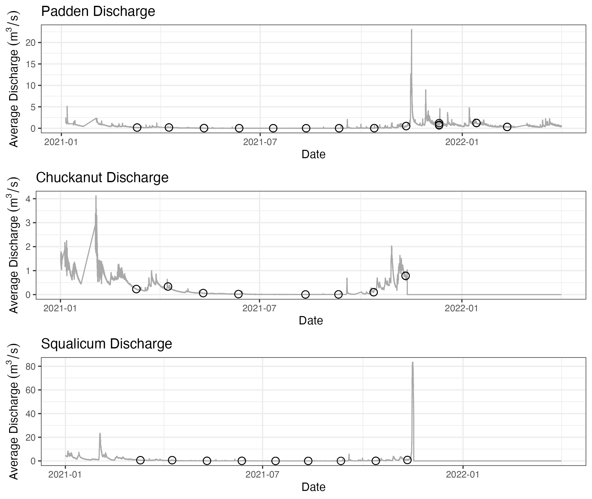

```{r setup, include=FALSE}
knitr::opts_chunk$set(echo = TRUE)
library(here)
```


[Draft for *Ecological Applications*, Fall 2022]

## Abstract

Environmental laws around the world require some version of an environmental impact assessment surrounding construction projects and other discrete instances of human development. Information requirements for these assessments vary by jurisdiction, but nearly all require an analysis of the living elements of affected ecosystems. Because it is possible to sample and amplify the genetic material of many species present in those environments, amplicon-sequencing — also called metabarcoding or environmental DNA (eDNA) analysis — is a tractable, powerful, and increasingly common way of doing environmental impact analysis for development projects. Here, we analyze a 12-month time-series of water samples taken before, during, and after a construction project in a salmonid-bearing freshwater stream. We use an asymmetrical BACI design with multiple control streams to develop a robust background expectation against which to evaluate the impact of this discrete human intervention in the treatment stream. We generate calibrated, quantitative metabarcoding data from 12s mtDNA and complementary qPCR data to yield multi-species estimates of absolute eDNA abundance across time, creeks, and sampling stations. We then use a hierarchical Bayesian time-series model to reveal patterns of eDNA abundance over time, and to estimate the effects of the culvert removal on salmonids in the treatment creek. 
  We focus our analysis on four common salmonid species in the data: cutthroat trout (*Oncorhynchus clarkii*), coho trout (*O. kisutch*), rainbow trout (*O. mykiss*), and sockeye salmon (*O. nerka*). After accounting for temporal variability common to the sampled creeks, we find only transient effects on these species during the several months after construction. In the context of billions of dollars of court-mandated road-culvert replacements taking place in Washington State, USA, our results suggest that culvert-removal can be conducted with only minimal impact to key species of management concern. More broadly, we demonstrate a rigorous, quantitative method for environmental-impact reporting using eDNA that is widely applicable in environments worldwide.


## Introduction

At present, it is difficult or impossible to measure the environmental impacts of discrete human activities, despite such assessment often being required by law. Within the United States, both state and federal laws often require a form of environmental-impact assessment for medium- to large-scale projects (i.e., those that might have a significant impact on the environment) [CITE]. Outside the US, many nations have their own versions of these same laws. Specifically when measuring impacts on aquatic ecosystems, assessments generally continue to rely on literature reviews or field measurements of a few key species, selected beforehand [CITE]. These traditional methods are often expensive, require experts to physically go to every field site, and both rely on just a few species and are extremely limited in spatial and temporal coverage [CITE]. Moreover, they often lack post-project sampling, or sufficient post-project sampling, given that the goals of a development project normally focus on construction itself and funding is often extremely limited. 

All methods of environmental sampling are biased, in the sense that they capture a selective portion of the biodiversity present. Net samples for fish, for example, fail to capture species too small or too large to be caught in the net; bacterial cultures capture only those species that can be cultured on available media, and so forth. Despite the pleasing simplicity of the idea, there is no one way to survey the world and just “see what is there.” Environmental DNA, however, comes as close to this goal as any method yet developed: a sample of water, soil, or even air, contains the genetic traces of many thousands of species, from microbes to whales. Sequencing environmental DNA (eDNA) is means of surveying many species in a consistent and scaleable way [CITE]. Sampling water to collect eDNA before, during, and after a development project would be a new and powerful way of assessing that project’s impacts on the local biological communities, and conceivably could become the standard way to do such impact assessment. Environmental assessments have begun to make use of eDNA for such work [CITE NatureMetrics, few published examples] around the world, but are not yet common practice. 

Surveying the natural world by amplifying and sequencing DNA from environmental sources such as water, air, or soil has long been commonplace in microbial ecology (Rondon et al. 2000; Ogram, Sayler, and Barkay 1987; Turnbaugh et al. 2007), but has recently become popular for characterizing ecological communities of eukaryotes (Port et al. 2016; Stat et al. 2017; R. P. Kelly et al. 2014; Valentini et al. 2016; Taberlet et al. 2012; De Vargas et al. 2015). Because the source of samples is the environment itself (e.g., water) rather than specific target organisms, the data resulting from such studies have become known as environmental DNA (eDNA) (Taberlet et al. 2012); the ultimate source of genetic material in the environment may be living or waste cells or extracellular DNA (Taberlet et al. 2012). Techniques that take advantage of such data may include non-PCR-based methods such as hybridization, but generally include an amplification step such as quantitative PCR, digital or digital-droplet PCR, or traditional PCR from mixed templates followed by high-throughput sequencing [CITE]. This last technique is known as metabarcoding, eDNA amplicon-sequencing, or more generally, marker-gene analysis.

In a metabarcoding approach, broad-spectrum PCR primers capture many taxa across a very wide diversity of the tree of the life (e.g., Leray et al. 2013), but nevertheless the absence of a taxon from a sequenced sample does not indicate the absence of that taxon from the environment [CITE]. Instead, the unsampled species simply may not have been susceptible to that set of PCR primers, and so failed to amplify. The result is often a dataset that represents hundreds or thousands of taxa, but these taxa are a fraction of a larger (and perhaps taxonomically broad) pool of species present. Using multiple, independent primer sets increases taxonomic scope by drawing from overlapping pools of taxa (Kelly et al. 2017), maximizing the likelihood of detecting any given taxon present. In virtually all comparisons, metabarcoding recovers far more taxa from an area than any other sampling method (Port et al. 2016; Kelly et al. 2017).

The results of metabarcoding studies differ dramatically from those of traditional, non- PCR-based sampling methods as a result of the PCR process itself. This exponential process means that 1) small changes in laboratory technique can yield large differences in outcomes, 2) PCR-based assays likely act differently on every target species, 3) there is consequently no one-to-one correspondence between the number of assigned reads in an eDNA study and the abundance of the source organism, and 4) neither might we expect a universally strong correlation in estimates of taxon-richness between eDNA and traditional methods. By understanding these process differences, we can correct for taxon-specific biases in amplification efficiency to yield quantitative estimates of the community composition prior to PCR (Shelton et al. 2022). 

<!-- a little worried this previous paragraph sounds too dramatic -->

The resulting metabarcoding dataset is compositional, revealing the proportions of each species' DNA present in each sample, but importantly this contains no information about the absolute abundance of DNA present. We can tie these proportional estimates to absolute abundances using additional data such as a qPCR assay for one of the taxa present. Thus, we can use qPCR and metabarcoding together to maximize the information gleaned from the same samples by obtaining information about many species through metabarcoding, and then grounding the compositional dataset to quantifications provided from the results of a qPCR assay for a single species that is also detected in the metabarcoding approach. Together, we can use these data to assess changes in eDNA concentrations of species over time, and due to environmental impacts such as replacing a culvert under a road. 

<!-- Add transition sentence here? -->

As a result of a federal court ruling [US v Washington, culvert case, J. Martinez], Washington State is under a court order to replace hundreds of culverts that allow water to pass under roads and highways. The culverts that need to be replaced, at present, collectively prevent or hinder anadromous salmon species from using hundreds of miles of habitat, which in turn violates the treaty rights of the region's indigenous tribes. Because replacing culverts can require substantial intervention -- for example, diverting the water from a creek segment and rebuilding the road with a redesigned culvert -- they require environmental impact assessments. Furthermore, because these replacements occur serially according to a schedule, they present an attractive experimental design to use eDNA to assess environmental impacts.

Here, we report the results of a yearlong eDNA sampling effort before, during, and after a small construction project in our experimental creek, assessing the impact of that project on the salmonid species present. We do so using a combination of metabarcoding (12s mtDNA) and qPCR to yield quantitative estimates of the concentrations of DNA present at each time point, and we use parallel samples from an additional four control creeks to develop a causal analysis of changes in these concentrations. A clear opportunity for policy-relevant eDNA work is in using its power to survey many species at a time to improve the way we assess the impacts of human activities. We demonstrate the utility of eDNA for such assessments. 

## Methods 

We used an asymmetrical BACI (Before-After-Control-Impact) study design to measure the environmental impact of a construction project replacing the under-road culvert in the treatment creek using eDNA [CITE]. We sampled four control creeks in addition to the treatment creek (Figure 1) at monthly intervals, both upstream and downstream of each creek's culvert. Because salmonids are the primary species of management concern in these creeks, we focus the present analysis on the four salmonid species most common in our data: *Oncorhynchus clarkii* (cutthroat trout), *O. kisutch* (coho salmon), *O. mykiss* (rainbowand steelhead trout), and *O. nerka* (sockeye and kokanee salmon). As further described below, we surveyed the salmonid DNA present in each creek via eDNA metabarcoding (targeting a region of the 12s mtDNA gene) and complementary quantitative PCR (qPCR; targeting a region of the CytB gene) for a reference species (*O. clarkii*), which in combination yielded quantitative estimates for each fish species throughout the study area. 

Construction to replace the culvert in our treatment creek occurred midway through our yearlong survey. We were then able to quantify the effect of the culvert replacement itself -- controlling for temporal trends, background environmental variability, and sampling variability -- using a Bayesian time-series model to jointly model salmon eDNA abundances across creeks, time points, sampling stations, and species. 

### Water Sampling

We collected water samples monthly between March 2021 and February 2022 in each of five salmonid-bearing creeks in northwest Washington State, USA (Figure 1). We sampled each stream above and below under-road culverts, each of with a different degree of expected fish passibilty as determined by the Washington Department of Transportation (Supplemental Text 1) [CITE]. The culvert in the treatment creek (Padden) was suspected to be impassible and thus was removed and replaced during the course of the study; two of the four creeks had culverts allowing fish passibility (Portage and Squalicum), and two had culverts blocking fish passage (Barnes and Chuckanut). 

<!-- Ez to check here. -->

{width=50%}

At each sampling station (N=2, upstream and downstream of a culvert) at each creek (N = 5) in each month (N = 12), we collected three 2-liter water samples, for a total of 360 samples. Water samples were collected using Smith Root's eDNA Backpack [CITE], a portable pumping-and-filtering device set to filter at 1 L/min at 82.7 kPa (12 psi). In some months, less than 2 L of water was filtered due to clogging (Supplemental Table 1). Water samples were filtered through 5$\mu$m self-preserving filters (Smith Root, Vancouver, WA) using single-use inlet tubes, dried, and kept at room temperature until DNA extraction within 1 month of collection (CITE self-preserving filter paper).

Water discharge varied throughout the year, with lowest discharge in summer months and highest discharge in winter months (Figure 2. Flow gauges maintained by USGS were used for Padden Creek, Chuckanut Creek, and Squalicum Creek. During the year of sampling, the flow gauges at Chuckanut Creek and Squalicum Creek stopped metering after a major flooding event. To find discharge rates for each creek to correct eDNA concentrations by discharge, five years of historical data (2015-2020) of the three creeks were used to generate a monthly averaged correction factor based on Padden Creek. For the year of sampling (2021-2022), the discharge rates used at Chuckanut and Squalicum Creeks were estimated based on the correction factor from Padden Creek (Supplemental Figure 1). No discharge data was available for Portage Creek or Barnes Creek. Based on field sampling conditions, the discharge from Padden Creek was used as a proxy for both Portage and and Barnes as they were similar sizes and flow rates. Though in the year of sampling, the discharge in Padden Creek ranged from no metered flow to 23 m\textsuperscript{3}/s, the discharge on the dates of sampling only reached a maximum of 1.3 m\textsuperscript{3}/s.  

{width=70%} 

Additionally, in the creek of interest, Padden Creek, *O. mykiss* (rainbow trout) were stocked in Lake Padden, approximately 1.5 km upstream of the sampling sites. Occasionally, cutthroat trout (*O. clarkii*) and kokanee salmon (*O. nerka*) have been stocked in the past as well. During the course of the study, a total of 10,000 rainbow trout were stocked in April and May 2021, 30,000 kokanee salmon were stocked in May 2021, and 10,000 cutthroat trout were stocked in January 2021 (Supplemental Figure 2).

<!-- Remove stocking from methods? -->

### DNA Extraction, Amplification, Sequencing

All molecular work was performed at the University of Washington. Benchtops were cleaned with 10% bleach for 10 minutes and then wiped with 70% ethanol. Molecular work was separated onto pre- and post-PCR benches; all DNA extractions and PCR preparation was conducted on a bench where no PCR product was handled. DNA was extracted from half of each filter using a Qiashredder column (Qiagen, USA) and the DNEasy Blood and Tissue Kit (Qiagen, USA) with an overnight incubation (Supplemental Text 1,[CITE]), such that the effective filtering effort was 1 L/sample; the remaining half of each filter was archived at -20\degree C. Extracts were eluted in 100 uL of molecular grade water, quantified via Qubit (Invitrogen, USA) and stored at -20\degree C until PCR amplification within 2 months of extraction.

<!-- MGY - check longest delay from collection to extraction -->

For metabarcoding, we targeted a ~170 bp hypervariable region of the mitochondrial DNA 12S rRNA gene for PCR amplification (MiFish; Miya et al. 2015), but using modified primer sequences as given in Praebel and Wangensteen [cite] and including the Illumina Nextera overhang sequences for subsequent indexing. The primers used were as follows: F 5' *TCGTCGGCAGCGTCAGATGTGTATAAGAGACAG*GCCGGTAAAACTCGTGCCAGC 3', R 5' *GTCTCGTGGGCTCGGAGATGTGTATAAGAGACAG*CATAGTGGGGTATCTAATCCCAGTTTG 3' (italics indicates Nextera overhang). The final reaction recipe and cycling conditions are in Supplemental Text 1. Each month of samples was amplified on a single plate with the addition of a no template control (NTC; molecular grade water in lieu of template) and a positive control (genomic DNA from kangaroo). After PCR amplification, PCR products were visualized on a 1-2% gel. If no band was present for a given sample, a new amplification was attempted with extracts diluted 10x iteratively until a band was detected. PCR products were size-selected and cleaned using MagBind Beads (Omega Biotek, USA) at a sample:beads ratio of 1.2. Bead-cleaned PCR products were eluted in 30 $\mu$L of molecular grade water and quantified via Qubit (Invitrogen, USA).

A indexing PCR reaction added a unique index to each sample using Nextera indices (Illumina, XX) to allow pooling multiple samples onto the same sequencing run (See Supplemental Text 1 for details). Indexed PCR products were also size-selected and purified using MagBind Beads (Omega Biotek, XX) at a sample:beads ratio of 0.8. Bead-cleaned PCR products were eluted in 30 $\mu$L of molecular grade water and quantified via Qubit. Indexed and bead-cleaned products were normalized before pooling into libraries, which were subsequently quantified via Qubit and visualized on a Bioanalyzer (Agilent, XX) before sequencing. Samples were randomized in 3-month blocks and each block split across 3 sequencing runs, for a total of 12 MiSeq runs. The loading concentration of each library was 4 nM and 5-20% PhiX was included depending on the composition of the run (Supplemental Table 2). 

In total, sequencing runs generated ~42 million reads across XX environmental samples (12 months x 2 stations x 5 creeks x 3 biological replicates = 360 filters) and 27 mock community samples (3 communities x 9 replicates [6 even, 3 skewed proportions]) for calibration (see below). After quality-filtering and merging all runs, XX reads remained from XX amplicon sequence variants (ASVs), of which XX% of reads and XX% of reads were annotated to species level. 

Importantly, the particular target salmonid ASVs in the mock communities were found in environmental samples, unambiguously linking the taxa in calibration samples with those in environmental samples. The most common salmonid species found in the environmental samples was *O. clarkii* (cutthroat trout), with XX% of samples across times, creeks, and stations having at least 50% of reads assigned to *O. clarkii*.

### Bioinformatics 

After sequencing, bioinformatic analyses were conducted in R [CITE]. Information about the bioinformatics pipeline is included in the supplement (Supplemental Text 1). Briefly, primer sequences were removed using Cutadapt (Version 1.18) [cite cutadapt] before dada2 [CITE] trimmed, filtered, merged paired end reads, and generated amplicon sequence variants (ASVs). Taxonomic assignment was conducted via the insect package [CITE] using a tree generated by the developers for the MiFish primers that was last updated in November 2018. Only species level assignments from insect were retained and ASVs not annotated or not annotated to species level were then checked against the NCBI nucleotide database using BLAST+ [CITE]. Query sequences that matched a single species at >95% identity were retained.  

From all the ASVs generated from environmental samples, a total of X unique ASVs were found, with X% of ASVs (representing X% of reads) assigned to species level (Supplemental Table 2). Only reads assigned to the four salmonids of interest were retained for further analysis, which was X% of reads. 


### Quantitative PCR and Inhibition Testing 

We quantified cutthroat trout (*O. clarkii*) DNA in each sample, targeting a 114 bp fragment of the cytochrome b gene with a qPCR assay [CITE]. The primer/probe sequences were: F 5' CCGCTACAGTCCTTCACCTTCTA 3', R 5' GATCTTTGTATGAGAAGTAAGGATGGAA 3', P 5' 6FAM-TGAGACAGGATCCAAC-MGB-NFQ 3'. The qPCR assay was multiplexed with TaqMan Exogenous Internal Positive Control Reagents (EXO-IPC) (Applied Biosystems) to check for the presence of PCR inhibitors[CITE]. Each DNA sample was run in triplicate; the final recipe and thermocycling conditions can be found in Supplemental Text 1. The EXO-IPC mix includes the primers and probe for the EXI-IPC DNA, with the probe having a VIC reporter, allowing it to be multiplexed with the *O. clarkii* assay, which has a FAM reporter. All qPCRs were conducted on an Applied Biosystems StepOnePlus thermocycler. 

<!-- include qpcr data as supplemental table? -->

Each plate included a 8-point standard curve created using synthetic DNA (gBlocks) at the following concentrations: 100,000 copies/$\mu$L, 10,000 copies/$\mu$L, 1,000 copies/$\mu$L, 100 copies/$\mu$L, 10 copies/$\mu$L, 5 copies/$\mu$L, 3 copies/$\mu$L, 1 copy/$\mu$L Additionally, six NTCs were included on each plate: 3 with the IPC DNA mix and 3 with molecular grade water instead of template or IPC DNA mix. Plates were re-run if efficiency as determined by the standard curve was outside of the range of 90-110%. 

To check for inhibition, the cycle threshold (Ct) value determined for the EXO-IPC assay from the NTC was compared to the Ct value for the EXO-IPC assay in each of the environmental samples. If the Ct value was >0.5 Ct values from the mean Ct for the NTCs, the sample was deemed inhibited and diluted 1:10 and re-assayed until the Ct value fell within the accepted range. The majority of environmental samples (65%) were inhibited and accordingly diluted for analysis. In 75% of inhibited samples, a 1:10 dilution remedied the inhibition, but some samples required dilution by a factor of up to 1000. 

<!-- include in qpcr table?  -->

All qPCR data was processed in R using Stan [CITE], relating environmental samples to the standard curve via a linear model (Figure 2, blue boxes). We amended the standard linear regression model to more realistically capture the behavior of qPCR observations, accommodating non-detections as a function of underlying DNA concentration, and letting the standard deviation vary with the mean (lower-concentration samples had more uncertainty).See also See Shelton et al. 2019; McCall et al. 2014 (<https://www.ncbi.nlm.nih.gov/pmc/articles/PMC4133581/>); see Supplemental Text 2 for full statistical details. Subsequent analysis corrected for sample-specific dilution if found inhibited and corrected for any variation in water-volume filtered during sample collection. 

### Quantitative Metabarcoding

Here, we used a mock community to determine the species-specific amplification efficiencies for each salmonid in the study. Briefly, we constructed three communities with known proportions of starting DNA from different species (total DNA as measured by Qubit). Each community was constructed with an even proportion of each species and a skewed proportion. We sequenced these communities using the same metabarcoding primers and thermocycling conditions above and then can determine the species-specific amplification rates given the discrepancy between the known starting proportion and the proportion of reads after sequencing. These mock community data are then used to correct the sequencing reads from the environmental samples to estimate the starting DNA proportions of each species in environmental samples, which is the metric of interest (Figure 2, green boxes). See Shelton et al. 2022 and Supplemental Text 1 for more information. The intercalibration of the mock community samples demonstrates the rank order of ampliciation efficiencies for salmonids (Supplemental Figures 3 and 4). *O. clarkii* and *O. nerka* had similar amplification efficiencies, both of which were higher than *O. mykiss* and *O. kisutch*, which had the lowest amplification efficiency.  

<!-- Add in O. nerka when new model is run.   -->

Calibrated metabarcoding analysis yielded quantitative estimates of the proportions of species' DNA in environmental samples prior to PCR. We then converted these proportions into absolute abundances by expansion, in light of the qPCR results for our reference species *O. clarkii*. We estimated the total amplifiable salmonid DNA in environmental sample $i$ as $DNA_{salmonid_{i}} = \frac{[qPCR_{reference_{i}}]}{Proportion_{reference_{i}}}$, and then expanded species' proportions into absolute concentrations by multiplying these sample-specific total concentrations by individual species' proportions, such that for species $j$ in sample $i$, $DNA_{i,j} = DNA_{salmonid_{i}} * Proportion_{i,j}$. Finally, we convert from DNA concentration [copies/L] to a mass flow rate [copies/s] after multiplying by the discharge of each creek [m\textsuperscript{3}/s] (Figure 2, solid purple boxes). 

{width=75%} 

### Estimating the Effects of Culvert Replacement and of Culverts Themselves

Consistent with the asymmetrical BACI study design, we generated data from our four control creeks as context against which to compare the observations in Padden Creek, our treatment creek. Recognizing that these observations are autocorrelated in time, we use an AR(1) autocorrelation model, implemented in Stan via R, to capture the observed temporal trends. At time $t$, the expected log-DNA concentration for species $j$ in creek $i$ at station $d$ is a linear function of the DNA concentration for the same species/creek/station at $t-1$ (Equation X). We add an index $r$ to distinguish samples from creeks and time-points that had not undergone culvert replacement (controls; $r = 1$) from those samples in the treatment creek during and post-replacement (treatment; $r = 2$). 

```{=tex}
\begin{align*}
 Y_{i,t,d,j} &\sim \mathcal{N}(\mu_{i,t,d,j},\,\sigma^{2})\\
\mu_{i,t,d,j} &= \alpha_{i,t,j} + \beta_{j}\mu_{i,t-1,d,j} + \gamma_{t,j,r} + \eta_{i,t,d,j}
\end{align*}
```


The model shares information across creeks and time-points via a species-specific slope term $\beta_{j}$, which reflects characteristic degrees of autocorrelation for each species. Intercept $\alpha$ varies by time, creek, and species, capturing creek-level deviations from the previous time-step. 

The $\gamma$ term explicitly captures the effect of culvert replacement at time $t$ for species $j$. We define $\gamma_{r = 1} = 0$, such that the parameter estimates for samples during and after replacement, $\gamma_{r = 2}$, capture the effect of culvert replacement relative to a baseline of zero.

Finally, for a given time/creek/species, the difference in log-DNA concentration between upstream and downstream stations is calculated as the difference between the parameter values of $\eta$ for the two stations. All samples share a species-specific observation-variance term, $\sigma_{j}$.  

We fitted this model in a Bayesian framework using moderately informative priors on all parameters, and confirmed model convergence ($\hat{R} < 1.01$) across 3 chains and 2500 model iterations. See statistical supplement (Supplemental Text 2) for prior values, diagnostics, and full model details.


## Results

### Metabarcoding and Quantitative PCR

After calibrating metabarcoding data using mock communities, we estimated the salmonid composition across time points, creeks, and stations (Figure 3). The culvert in one control creek (Barnes) appeared to be a total barrier to salmonid passage, with salmonid eDNA detected upstream of the culvert at only three time points, in contrast to being detected at every time point in the downstream station of the same creek. The other four creeks had no such pattern associated with the culverts, suggesting that fish passage may have been possible in each case. 

{width=90%} 

All environmental samples (n = 356, should be 357, one set of triplicates missing from Sqm Up August, otherwise 3x2x5x12 = 360) were quantified for absolute concentrations of cutthroat trout DNA across 30 plates, resulting in 280 samples with a positive detection in at least 1 of 3 technical replicates. The modeled output of cutthroat trout DNA concentrations, ranged from 10 copies/L to 1,377,656.67 copies/L, with a mean value of 57,529 copies/L (Figure 4). 

{width=60%}

We combined compositional information from metabarcoding with absolute concentrations for our reference species, *O. clarkii*, from the qPCR to estimate the total concentration of DNA for each species. 

### Trends in Abundance

The joint time-series model shared information across stations and creeks; consequently, data from one of the control creeks (Barnes) could not be included because of the total absence of salmonids upstream of its culvert. However, data from the remaining creeks characterized trends in the target species well (Figure 5).

![Trends across creeks and across time for each of three salmonid species as estimated by eDNA analysis. Light-colored dots are posterior means derived by expanding the calibrated metabarcoding proportions as described in the main text; darker-colored dots are posterior means for the time-series model of the same. Colors indicate station upstream or downstream of an under-road culvert. 75% and 95% posterior CI plotted for each timepoint. Grey shading indicates the time period in which the culvert in the treatment creek (Padden Creek) was replaced. ](../Output/Figures/20221123_multispeciesTrends_flowcorrected.png){width=75%}  

<!-- Uncertainty at each time-point is related to mean abundance [I think]. -->

### Effects of Culverts Generally and of Culvert-Removal

Before considering the effect of construction, the difference in abundance trends between upstream and downstream stations (Figure 5) demonstrate that the culverts themselves have some effect, but not a large effect on the salmonid species surveyed. Summarizing over all species, all creeks, the effect was largest during the dry periods of summer (July, August, and September), when flows were at a minimum and the connectivity between upstream and downstream was low (Figure 6). Salmonid species were higher upstream than downstream during this period, with mean upstream DNA about 10% higher concentration than downstream DNA Individual species' patterns were similar, indicating that there is not a species-specific effect where culverts block the passage of some salmon but not others (Supplemental Figure 5). A notable exception is *O. kisutch* in Chuckanut Creek, at some point reaching over 50% higher concentration upstream than downstream. Padden Creek and Squalicum Creek had the lowest percent difference over the course of the year.

<!-- NOTE TO SELF: so Padden/Chuckanut were thought to be not fish passable -- and Portage/Squalicum are supposed to be fish passable and they had barrrier replacements not too long ago. I could actually see the argument both ways that not passable would have larger differences between up/down (Chuckanut) because OR passable would have larger differences up/down because fish are in fact moving up and down... AHA! Maybe it must also include the directionality -- not passable is either no change or more down, passable is either no change or more up? -->

<!-- Ryan's note to self: [what if fish were all upstream, and that's where DNA was?] -->

{width=60%}
<!-- NOTE TO SELF: change x axis order, see if outliers are missing data....  -->
<!-- RPK to check that this figure caption is true.  -->

The effects of the culvert-removal operation appear to have been transient and fairly minor for the four salmonid species surveyed. After the beginning of construction in September 2021 through the end of sampling in February 2022, we see fluctuations in the percent changes of salmonid DNA due to the culvert removal (Figure 7). *O. clarkii* is the least impacted species of the construction and *O. nerka* and *O. mykiss* were the most impacted species, likely due to their already low concentrations in the creek. For all species, a very slight drop in concentration occurs in September and October (ca. 5-25% depending on the species), followed by an clear increase in November (ca. 20-50% depending on the species), and then a stabilization of the concentration in December through February.

Of note, fish were exluded on August 30th, 2021 in preparation for the stream to be diverted on September 9th, 2021 and the diversion was removed October 7th, 2021. Water sampling occurred on September 10th, 2021, the day after the diversion, and on October 12, 2021, just 5 days after reconnecting the stream (Supplemental Table 1). 

<!-- NOTE TO SELF: check to see that big reductions in mykiss and nerka in sept is not due to both being very low numbers?  -->

<!-- NOTE TO SELF: check to see that big impact in Nov is not due to missing qPCR data upstream.... but it means that we really think there was no cutthroat upstream in Nov - so maybe that is real?  -->

{width=60%}


## Discussion

### Environmental DNA can provide quantitative measurements of environmental impacts

A clear seasonal pattern occurred for all the salmonids detected in the study. The time series model uses shared information across creeks to include the change in eDNA concentrations due to time, whether a sample was collected below or above a barrier (i.e., culvert), and whether or not there was construction occurring. Thus, we could isolate the changes in eDNA concentrations as a result of the intervention (i.e., construction) while accounting for the variance due to time and station (i.e., season and culvert).    

Furthermore, we can use just one qPCR assay in combination with metabarcoding data to get information about many more species without running n qPCR assays for n species detected in metabarcoding data (which is also particularly helpful for species that don't have a previously published assay).  

### Not all culverts are barriers 
By measuring DNA concentrations of species above and below culverts on a small spatial scale, we were able to determine how much of a barrier each culvert was (or was not) to fish passage. We found that four of the five creeks sampled did not seem to be major barriers to fish passage. The only creek that was determined to be a barrier to fish passage was Barnes Creek, as we only found salmonid DNA in three months of the twelve months of sampling, and those three months had very low conentration of salmonid DNA relative to the other creeks. 

Of the creeks where salmonid DNA was consistently found, Chuckanut Creek had the largest discrepancies between DNA concentrations found below and above the barrier at each time point. The culvert in Chuckanut Creek is suspected to be a barrier to fish passage and the State of Washington's Department of Transportation (WSDOT) is planning to replace it in the near future. 

The culverts at Portage Creek and Squalicum Creek were more recently installed as compared to Padden, Chuckanut, and Barnes Creeks. They also were not designated by WSDOT as blocking fish passage. Squalicum Creek had the lowest difference between upstream and downstream concentrations across all the surveyed creeks. Portage Creek had a higher 

### Salmonids can survive a bulldozer in a creek 
<!-- NOTE: help workshop this section header  -->

The intervention (i.e., construction) in Padden Creek occurred over about two months and included the "de-watering" of the creek, removal of the existing culvert, installation of the new culvert, and then the "re-watering" of the creek from late August 2021 to October 2021. The impact of the construction itself on salmonid species demonstrates an initial decrease in DNA concentrations in September and October, followed by a large increase in DNA concentration in November, and then a stabilization and return to nearly baseline concentrations from December to February. This pattern remarkably demonstrates an expected response to a large intervention. During the actual construction, we found less eDNA from salmonids, but after the completion of the installing a new culvert, concentrations increased and then returned to baseline. 

The overall pattern of this effect was similar for the four species of salmonids, but the species of which we found higher eDNA concentrations seemed to have a dampened effect compared to the rarer species. This also corresponds to species with different life histories and behaviors, and it might be that our most commonly and abundant species, *O. clarkii*, was more robust to the intervention because it has both migrating and non-migrating subspecies (see below). 

<!-- If we had expected the culvert to be a real serious barrier, we might have expected the percent change to remain elevated in December and beyond as it would have improved fish passage from the old culvert.  -->

### Fish migrations and expected patterns 
<!-- NOTE: help workshop this section header  -->

Here, we consider four salmonid species to assess fish passage and the impact of construction. These four species, and even individuals within a species, have different behavior that would impact where fish might be in the creeks and therefore eDNA concentrations. For example, within cutthroat trout (*O. clarkii*) there might be both non-migrating, resident trout in the creeks and coastal run cutthroat that migrate into Padden Creek from Bellingham Bay. Similarly, *O. nerka* includes both anadromous sockeye salmon and non-migrating kokanee salmon and *O. mykiss* includes both anadromous steelhead trout and non-migrating rainbow trout. 

For migratory salmonids, the run timings vary for each species. In the Bellingham area, coastal cutthroat (*O. clarkii*) are documented to run throughout the entire year, whereas coho salmon (*O. kisutch*) run timings are September to December, kokanee salmon (*O. nerka*) run October to December, and steelhead trout (*O. mykiss*) run November to June. 

Using eDNA, we cannot distinguish between the migrating and non-migrating subspecies of *O. clarkii*, *O. nerka*, and *O. mykiss*. Therefore, our eDNA concentrations might reflect contributions from both migrating and non-migrating individuals at any given time point in the dataset. However, the metabarcoding data demonstrates that in Padden Creek, there is a clear signal of *O. nerka* both upstream and downstream only in November 2021-2022 (and only upstream in March 2021). This signal corresponds well with the documented run timing of October to December.

<!-- NOTE TO SELF: Add as supplelmental figure? Run timing, stocking (historical or just 2021?), spawner surveys (only have historical) -->

For the other salmonids included in this study, *O. kistuch* does not have a non-migrating subspecies, but eDNA is found in months outside of the expected run timing of September to December. This could potentially be due to juveniles maturing and migrating in the creeks after adults migrate during the run time up the creeks to spawn. *O. mykiss* is also found nearly year-round in Padden Creek and Chuckanut Creek, which could be contributions from migrating steelhead (November to June), juveniles maturing and migrating, or from residential rainbow trout. Though the *O. mykiss* signal is found year-round, the highest concentrations do seem to correspond with the steelhead run timing. 


### Decoupling of eDNA from fish 
<!-- NOTE: help workshop this section header  -->

Though eDNA can move downstream with water flow, here, we were measuring if culverts were barriers to fish moving upstream as we were focused on the impact of culverts on migratory salmon. In our case, we were comparing if downstream stations had higher DNA concentrations than upstream stations as a result of fish being unable to get upstream. This is of course complicated as a result of non-migratory fish, which may be up or downstream and not attempting to pass through the culverts. 

<!-- Ryan's note to self: [what if fish were all upstream, and that's where DNA was?] -->

Finally, it should be noted that Lake Padden, about 1.5 km upstream from the sampling sites, was stocked with cutthroat trout in January 2021, rainbow trout in April and May 2021, and kokanee salmon in May 2021. Given that no sequencing reads in the metabarcoding data are found for *O. nerka* in May, the potential transport of eDNA downstream from Lake Padden to the location of eDNA sampling is expected to be negligible. Futhermore, Lake Padden is open for recreational fishing for all of these species and managers have reported that most of the stocked fish are caught soon after stocking [CITE WHO?]. 


### Accounting for flow rates with eDNA concentrations 


## Conclusion

